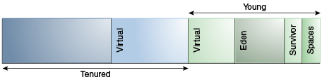

# 6 并行收集器

并行收集器（此处也称为吞吐量收集器）是一种与串行收集器类似的分代收集器；主要区别在于它使用多个线程来加速垃圾回收。可以通过命令行选项 `-XX:+UseParallelGC` 启用并行收集器。默认情况下，使用此选项时，Minor GC和 Major GC都会并行执行，以进一步减少垃圾回收开销。

在具有 N 个硬件线程（其中 N 大于 8）的机器上，并行收集器使用 N 的固定比例作为垃圾回收器线程的数量。对于较大的 N 值，该比例约为 5/8。当 N 小于 8 时，使用的数量为 N。在某些选定的平台上，该比例降至 5/16。可以使用命令行选项（稍后会介绍）来调整垃圾回收器线程的具体数量。在只有一个处理器的主机上，由于并行执行所需的开销（例如同步），并行收集器的性能可能不如串行收集器。但是，在运行具有中等到大型堆的应用程序时，在具有两个处理器的机器上，它通常会比串行收集器性能略好一些，而当有两个以上处理器可用时，其性能通常会明显优于串行收集器。

可以使用命令行选项 `-XX:ParallelGCThreads=<N>` 来控制垃圾回收器线程的数量。如果正在使用命令行选项对堆进行显式调优，那么使用并行收集器实现良好性能所需的堆大小与使用串行收集器时所需的堆大小相同。但是，启用并行收集器应该会使收集暂停时间更短。由于多个垃圾回收器线程参与了一次次要收集（Minor GC），在收集过程中，由于对象从新生代晋升到老年代，可能会出现一些碎片化问题。参与次要收集的每个垃圾回收器线程都会为晋升操作保留老年代的一部分空间，将可用空间划分为这些“晋升缓冲区”可能会导致碎片化效应。减少垃圾回收器线程的数量并增加老年代的大小将减少这种碎片化效应。

## 分代

如前所述，并行收集器中各代的布局有所不同。这种布局如图 6 - 1“并行收集器中各代的布局”所示：

***图 6 - 1 并行收集器中的分代排列\***



[“图 6 - 1 并行收集器中的分代排列”说明](https://docs.oracle.com/javase/8/docs/technotes/guides/vm/gctuning/img_text/jsgct_dt_002_armgnt_gn_pl.html)

*该图展示了并行收集器中各代的排列情况。该图由一排六个矩形组成。这些矩形的标注如下（从左到右）：*

1. *No label*
2. Virtual
3. Virtual
4. Eden
5. Survivor
6. Spaces

矩形 1 和 2 标注为“老年代”。矩形 3 至 6 标注为“新生代”。矩形 7 和 8 标注为“永久代”（上图未显示）。

## 并行收集器自适应优化

在服务器级别的机器上，默认选择并行收集器。此外，并行收集器采用一种自动调优方法，允许你指定特定行为，而不是指定代大小和其他低级调优细节。你可以指定最大垃圾回收暂停时间、吞吐量和占用空间（堆大小）。

- 最大垃圾回收暂停时间：最大暂停时间目标通过命令行选项 `-XX:MaxGCPauseMillis=<N>` 指定。这被解释为一个提示，即希望暂停时间为 `<N>` 毫秒或更短；默认情况下，没有最大暂停时间目标。如果指定了暂停时间目标，将调整堆大小和其他与垃圾回收相关的参数，以尝试使垃圾回收暂停时间短于指定值。这些调整可能会导致垃圾回收器降低应用程序的整体吞吐量，并且不一定总能达到期望的暂停时间目标。

- 吞吐量：吞吐量目标是根据执行垃圾回收所花费的时间与垃圾回收之外所花费的时间（称为应用程序时间）来衡量的。该目标由命令行选项 `-XX:GCTimeRatio=<N>` 指定，此选项将垃圾回收时间与应用程序时间的比率设置为 `1 / (1 + <N>)` 。

  例如， `-XX:GCTimeRatio=19` 将垃圾回收时间设定为总时间的 1/20 或 5%。默认值为 99，这会使垃圾回收时间目标设定为总时间的 1%。

- 占用空间：使用选项 `-Xmx<N>` 来指定最大堆占用空间。此外，只要满足其他目标，垃圾回收器会有一个隐含目标，即尽量减小堆的大小。

### 目标优先级

这些目标将按以下顺序解决：

1. 最大暂停时间目标
2. 吞吐量目标
3. 最小占用空间目标

首先要达成最大暂停时间目标。只有在达成该目标之后，才会考虑吞吐量目标。同样，只有在达成前两个目标之后，才会考虑占用空间目标。

### 代的大小调整

收集器记录的诸如平均暂停时间等统计信息会在每次收集结束时更新。随后会进行测试以确定是否达到目标，并对代的大小进行必要的调整。例外情况是，在统计记录和代大小调整方面，显式的垃圾回收（例如，对 `System.gc()` 的调用）会被忽略。

增大或缩小一个代（generation）的大小是按固定百分比的增量来进行的，该百分比是代大小的固定比例，这样代就能逐步趋近其期望大小。增大和缩小的速率不同。默认情况下，代以 20% 的增量增大，以 5% 的增量缩小。年轻代的增大百分比由命令行选项 `-XX:YoungGenerationSizeIncrement=<Y>` 控制，老年代的增大百分比由 `-XX:TenuredGenerationSizeIncrement=<T>` 控制。代缩小的百分比由命令行标志 `-XX:AdaptiveSizeDecrementScaleFactor=<D>` 调整。如果增大增量为 X%，那么缩小减量为 X/D%。

如果收集器决定在启动时增加代的空间，那么会在增量上添加一个补充百分比。这个补充值会随着收集次数的增加而衰减，并且没有长期影响。添加补充值的目的是提高启动性能。对于缩减操作，不会添加补充百分比。

如果未达到最大暂停时间目标，则每次仅缩小一代（这里是指新生代or老年代其中之一）的规模。如果两代（这里是指新生代和老年代）的暂停时间都超过了目标，则先缩小暂停时间较长的那一代的规模。

如果未达到吞吐量目标，则会增大两个代的大小。每个代的增大比例与其对总垃圾回收时间的贡献成正比。例如，如果新生代的垃圾回收时间占总回收时间的 25%，并且如果新生代的完整增量为 20%，那么新生代将增大 5%。


### 默认堆大小

除非在命令行中指定了初始堆大小和最大堆大小，否则它们将根据机器的内存量进行计算。


#### 客户端 JVM 默认初始和最大堆大小

默认最大堆大小为：当物理内存大小不超过 192 兆字节（MB）时，为物理内存的一半；当物理内存大小超过 192 兆字节且不超过 1 吉字节（GB）时，为物理内存的四分之一。

例如，如果你的计算机有 128 MB 的物理内存，那么最大堆大小为 64 MB；如果物理内存大于或等于 1 GB，则最大堆大小为 256 MB。

除非你的程序创建了足够多的对象来占用最大堆大小，否则 JVM 实际上不会使用该最大堆大小。在 JVM 初始化期间，会分配一个小得多的内存量，称为初始堆大小。这个内存量至少为 8 MB，若物理内存大小不超过 1 GB，则为物理内存的 1/64。

分配给新生代的最大空间量是堆总大小的三分之一。


#### 服务器 JVM 默认初始和最大堆大小

默认的初始堆大小和最大堆大小在服务器 JVM 上的工作方式与客户端 JVM 类似，只是默认值可能会更高。在 32 位 JVM 上，如果物理内存达到 4 GB 或更多，默认最大堆大小可达 1 GB。在 64 位 JVM 上，如果物理内存达到 128 GB 或更多，默认最大堆大小可达 32 GB。你始终可以通过直接指定这些值来设置更高或更低的初始堆和最大堆；请参阅下一节。


#### 指定初始和最大堆大小

你可以使用标志 `-Xms` （初始堆大小）和 `-Xmx` （最大堆大小）来指定初始和最大堆大小。如果你知道应用程序正常运行所需的堆大小，可以将 `-Xms` 和 `-Xmx` 设置为相同的值。如果不知道，JVM 将从使用初始堆大小开始，然后会扩展 Java 堆，直到在堆使用和性能之间找到平衡。

其他参数和选项可能会影响这些默认设置。要验证您的默认值，请使用 `-XX:+PrintFlagsFinal` 选项，并在输出中查找 `MaxHeapSize` 。例如，在 Linux 或 Solaris 系统上，您可以运行以下命令：

```
java -XX:+PrintFlagsFinal <GC options> -version | grep MaxHeapSize
```


## 过多的垃圾回收（GC）时间和内存溢出错误

如果在垃圾回收（GC）上花费的时间过多，并行收集器会抛出一个 `OutOfMemoryError` ：如果总时间的 98% 以上都花在了垃圾回收上，而堆内存的回收率低于 2%，则会抛出一个 `OutOfMemoryError` 。此功能旨在防止应用程序因堆内存过小而长时间运行却几乎没有进展。如有必要，可以通过在命令行中添加选项 `-XX:-UseGCOverheadLimit` 来禁用此功能。

## 度量

并行收集器的详细垃圾回收器输出与串行收集器的输出基本相同。