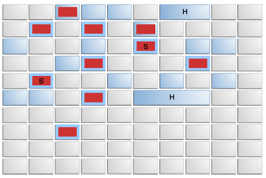

# 9 垃圾优先垃圾回收器

G1（Garbage-First，垃圾优先）垃圾回收器是一种服务器风格的垃圾回收器，适用于具有大容量内存的多处理器机器。它试图以高概率满足垃圾回收（GC）暂停时间目标，同时实现高吞吐量。诸如全局标记之类的全堆操作会与应用程序线程并发执行。这可以避免与堆或存活数据大小成比例的中断。

G1 收集器通过多种技术实现了高性能和停顿时间目标。

堆被划分为一组大小相等的堆区域，每个区域都是一段连续的虚拟内存范围。G1 执行并发全局标记阶段，以确定整个堆中对象的存活状态。标记阶段完成后，G1 会知道哪些区域大部分是空的。它会首先收集这些区域，这通常能释放出大量的空闲空间。这就是这种垃圾回收方法被称为“垃圾优先（Garbage-First）”的原因。顾名思义，G1 将其收集和整理活动集中在堆中可能充满可回收对象（即垃圾）的区域。G1 使用停顿预测模型来满足用户定义的停顿时间目标，并根据指定的停顿时间目标选择要收集的区域数量。

G1 将对象从堆的一个或多个区域复制到堆上的单个区域，在此过程中既进行内存压缩又释放内存。这种转移操作会在多处理器上并行执行，以减少停顿时间并提高吞吐量。因此，每次进行垃圾回收时，G1 都会持续致力于减少内存碎片。这是前两种方法都无法做到的。CMS（并发标记清除）垃圾回收不会进行内存压缩。并行压缩仅对整个堆进行压缩，这会导致相当长的停顿时间。

需要注意的是，G1 不是实时收集器。它有很高的概率达到设定的停顿时间目标，但并非绝对确定。基于之前收集的数据，G1 会估算在目标时间内可以收集多少个区域。因此，收集器对收集这些区域的成本有一个相当准确的模型，并利用该模型来确定在停顿时间目标范围内要收集哪些区域以及收集多少个区域。

G1 的首要关注点是为运行需要大堆内存且垃圾回收（GC）延迟有限的应用程序的用户提供解决方案。这意味着堆内存大小约为 6GB 或更大，并且稳定且可预测的暂停时间低于 0.5 秒。

如果应用程序具有以下一个或多个特征，那么目前使用并发标记清除（CMS）或并行压缩功能运行的应用程序，若切换到 G1 垃圾回收器将从中受益。

- 超过 50% 的 Java 堆被存活数据占用。
- 对象分配率或晋升率差异显著。
- 应用程序正经历不期望的长时间垃圾回收或压缩暂停（超过 0.5 到 1 秒）。

G1 计划作为并发标记清除收集器（CMS）的长期替代方案。将 G1 与 CMS 进行比较会发现一些差异，这些差异使 G1 成为更好的解决方案。其中一个差异是，G1 是一种压缩式收集器。此外，与 CMS 收集器相比，G1 能提供更可预测的垃圾回收停顿，并且允许用户指定期望的停顿目标。

与 CMS 一样，G1 专为需要更短垃圾回收（GC）停顿的应用程序而设计。

G1 将堆划分为固定大小的区域（灰色方框），如图 9 - 1“G1 的堆划分”所示。

***图 9 - 1 G1 的堆划分\***

[“图 9 - 1 G1 的堆划分”说明](https://docs.oracle.com/javase/8/docs/technotes/guides/vm/gctuning/img_text/jsgct_dt_004_grbg_frst_hp.html)

从逻辑意义上讲，G1 是分代的。一组空区域被指定为逻辑新生代。在图中，新生代是浅蓝色的。所有分配操作都在这个逻辑新生代中进行，当新生代满时，这组区域会进行垃圾回收（一次新生代回收）。在某些情况下，新生代区域集之外的区域（深蓝色的老年代区域）也可以同时进行垃圾回收。这被称为混合回收。在图中，正在被回收的区域用红色框标记。该图展示的是一次混合回收，因为新生代区域和老年代区域都在被回收。这次垃圾回收是一次整理式回收，它会将存活对象复制到选定的、最初为空的区域。根据存活对象的年龄，对象可以被复制到幸存者区（Survivor区）域（标记为“S”）或老年代区域（未具体展示）。标记为“H”的区域包含巨型对象，这些对象的大小超过一个区域的一半，会被特殊处理；请参阅《G1 垃圾收集器中的巨型对象和巨型分配》一节。

分配（疏散）失败

与 CMS 一样，G1 收集器在应用程序继续运行的同时执行部分垃圾收集工作，因此存在这样一种风险：应用程序分配对象的速度可能会快于垃圾收集器回收空闲空间的速度。有关类似的 CMS 行为，请参阅“并发标记清除（CMS）收集器”中的“并发模式失败”部分。在 G1 中，当 G1 将存活数据从一个区域（转移）复制到另一个区域时，就会发生失败（Java 堆耗尽）。进行复制操作是为了压缩存活数据。如果在对正在进行垃圾收集的区域进行转移时找不到空闲（空）区域，就会发生分配失败（因为没有空间来分配从正在转移的区域中存活的对象），并会进行一次“Stop-the-World”（STW）的全量垃圾收集。

## 漂浮垃圾

在 G1 收集过程中，对象可能会“死亡”但未被回收。G1 使用一种称为起始快照（SATB）的技术来确保垃圾回收器能够找到所有存活的对象。SATB 规定，在并发标记（对整个堆进行标记）开始时存活的任何对象，在本次收集过程中都被视为存活对象。SATB 允许出现浮动垃圾，其方式类似于 CMS 的增量更新。

## 暂停；停顿；间歇（这里“Pauses”是“pause”的第三人称单数和复数形式，根据语境可能有不同含义，这里给出常见释义）

G1 会暂停应用程序，将存活对象复制到新的区域。这些暂停可以是只收集年轻代区域的年轻代收集暂停，也可以是同时清空年轻代和老年代区域的混合收集暂停。和 CMS 一样，在应用程序停止时会有一个最终标记或重标记暂停来完成标记工作。不过，CMS 还有一个初始标记暂停，而 G1 将初始标记工作作为清空暂停的一部分来完成。G1 在一次收集结束时有一个清理阶段，该阶段部分是 STW（Stop-The-World，全局暂停）的，部分是并发的。清理阶段的 STW 部分会识别出空区域，并确定哪些老年代区域是下一次收集的候选区域。

## 牌桌与并发阶段

如果垃圾回收器不回收整个堆（即进行增量回收），那么垃圾回收器需要知道堆中未回收部分到正在回收部分的指针位置。这通常适用于分代垃圾回收器，在这种回收器中，堆的未回收部分通常是老年代，而正在回收的部分是新生代。用于保存此信息（老年代指向新生代对象的指针）的数据结构称为记忆集。卡表是一种特殊类型的记忆集。Java HotSpot 虚拟机使用字节数组作为卡表。每个字节称为一张卡。一张卡对应堆中的一个地址范围。将一张卡标记为脏卡意味着将该字节的值更改为脏值；脏值可能表示在该卡所覆盖的地址范围内存在从老年代到新生代的新指针。

处理一张卡片意味着查看该卡片，以确定是否存在从老年代到新生代的指针，并可能利用该信息进行一些操作，例如将其转移到另一个数据结构中。

G1 具有并发标记阶段，该阶段会标记从应用程序中找到的存活对象。并发标记从疏散暂停结束（初始标记工作在此完成）一直持续到重新标记。并发清理阶段会将收集后清空的区域添加到空闲区域列表中，并清除这些区域的记忆集。此外，根据需要会运行一个并发细化线程，以处理因应用程序写入而变脏且可能包含跨区域引用的卡表条目。

## 启动并发收集周期

如前所述，在混合式垃圾回收中，年轻代区域和老年代区域都会被回收。为了回收老年代区域，G1 会对堆中的存活对象进行完整标记。这种标记是通过并发标记阶段完成的。当整个 Java 堆的占用率达到参数 `InitiatingHeapOccupancyPercent` 的值时，就会启动并发标记阶段。可以使用命令行选项 `-XX:InitiatingHeapOccupancyPercent=` `<NN>` 来设置该参数的值。 `InitiatingHeapOccupancyPercent` 的默认值是 45。

## 暂停时间目标

使用标志 `MaxGCPauseMillis` 为 G1 设置一个停顿时间目标。G1 使用预测模型来确定在该目标停顿时间内可以完成多少垃圾回收工作。在一次回收结束时，G1 会选择下一次回收要处理的区域（回收集）。回收集将包含年轻代区域（这些区域大小的总和决定了逻辑年轻代的大小）。G1 部分是通过选择回收集中年轻代区域的数量来控制垃圾回收停顿的时长。你可以像使用其他垃圾回收器一样在命令行中指定年轻代的大小，但这样做可能会妨碍 G1 达到目标停顿时间。除了停顿时间目标，你还可以指定停顿可能发生的时间段长度。你可以在指定这个时间段（ `GCPauseIntervalMillis` ）的同时，结合停顿时间目标指定最小用户线程使用率。 `MaxGCPauseMillis` 的默认值是 200 毫秒。 `GCPauseIntervalMillis` （0）的默认值相当于对时间段没有要求。