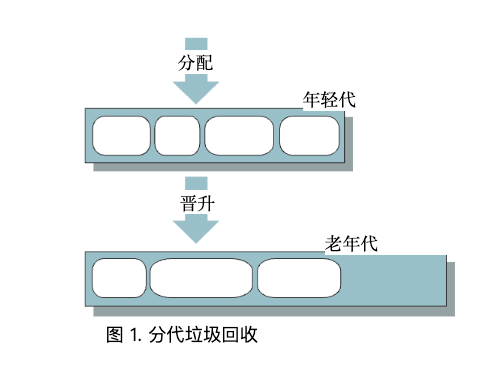

# Java HotSpot™ 虚拟机中的内存管理

Sun Microsystems公司 2006 年 4 月

# 目录

1 引言

2 显式内存管理与自动内存管理

3 垃圾回收概念

    理想的垃圾回收器特性
    
    设计选择
    
    性能指标
    
    分代收集

4 J2SE 5.0 HotSpot JVM 中的垃圾回收器

    HotSpot 分代
    
    垃圾回收类型
    
    快速分配
    
    串行收集器
    
    并行收集器
    
    并行压缩收集器
    
    并发标记清除（CMS）收集器

5 自适应优化——自动选择与行为调整

    收集器、堆大小和虚拟机的自动选择
    
    基于行为的并行收集器调优

6 推荐

    何时选择不同的垃圾回收器
    
    堆大小调整
    
    并行收集器的调优策略
    
    如何处理 OutOfMemoryError 错误

7 评估垃圾回收性能的工具

    –XX:+PrintGCDetails 命令行选项
    
    –XX:+PrintGCTimeStamps 命令行选项
    
    jmap
    
    jstat
    
    HPROF：堆分析器
    
    HAT：堆分析工具

8 与垃圾回收相关的关键选项

9 更多信息

# 1 引言

Java™ 2 平台标准版（J2SE™）的一个优势在于它能进行自动内存管理，从而使开发人员无需面对显式内存管理的复杂性。

本文全面概述了 Sun 公司 J2SE 5.0 版本中 Java HotSpot 虚拟机（JVM）的内存管理。文中介绍了可用于执行内存管理的垃圾回收器，并就如何选择和配置垃圾回收器以及设置垃圾回收器所操作的内存区域大小给出了一些建议。此外，本文还可作为参考资料，列出了一些最常用的影响垃圾回收器行为的选项，并提供了众多指向更详细文档的链接。

第 2 节是为初次接触自动内存管理概念的读者准备的。该节简要讨论了这种管理方式相较于要求程序员显式释放数据空间的优势。接着，第 3 节概述了通用的垃圾回收概念、设计选择和性能指标。它还介绍了一种常用的将内存划分为不同区域（基于对象预期生命周期划分的代）的组织方式。事实证明，这种按代划分的方式在广泛的应用程序中能有效减少垃圾回收的暂停时间和总体成本。

本文的其余部分提供了特定于 HotSpot Java 虚拟机（JVM）的信息。第 4 节介绍了四种可用的垃圾回收器，其中包括在 J2SE 5.0 update 6 中新增的一种，并记录了它们都采用的分代内存组织方式。对于每种回收器，第 4 节总结了所使用的回收算法类型，并指明了选择该回收器的合适时机。

第 5 节介绍了 J2SE 5.0 版本中一项新的技术，该技术结合了（1）根据应用程序运行的平台和操作系统自动选择垃圾收集器、堆大小以及 HotSpot JVM（客户端或服务器），以及（2）基于用户指定的期望行为进行动态垃圾收集调优。

这种技术被称为自适应优化。

第 6 节提供了选择和配置垃圾回收器的建议。它还提供了一些关于如何处理内存溢出错误（OutOfMemoryErrors）的建议。第 7 节简要介绍了一些可用于评估垃圾回收性能的工具，第 8 节列出了与垃圾回收器选择和行为相关的最常用命令行选项。最后，第 9 节提供了本文所涵盖的各个主题的更详细文档的链接。

# 2 显式内存管理与自动内存管理

内存管理是指识别已分配对象何时不再需要，释放这些对象所占用的内存，并使其可用于后续分配的过程。在一些编程语言中，内存管理是程序员的职责。这项任务的复杂性会导致许多常见错误，这些错误可能会导致程序出现意外或错误的行为，甚至崩溃。因此，开发人员往往需要花费大量时间来调试并尝试纠正这些错误。

在采用显式内存管理的程序中，经常出现的一个问题是悬空引用。有可能会释放某个对象所使用的空间，而其他对象仍持有对该对象的引用。如果持有该（悬空）引用的对象试图访问原对象，但该空间已被重新分配给一个新对象，那么结果将是不可预测的，并且并非预期的结果。

显式内存管理的另一个常见问题是内存空间泄漏。当内存被分配后不再被引用但却未被释放时，就会发生这种泄漏。例如，如果你打算释放一个链表所占用的空间，但却错误地只释放了链表的第一个元素，那么链表的其余元素就不再被引用，但它们超出了程序的控制范围，既无法被使用也无法被回收。如果发生了足够多的泄漏，它们会持续消耗内存，直到所有可用内存都被耗尽。

一种如今普遍采用的内存管理替代方法，尤其是大多数现代面向对象语言所采用的，是通过一个名为垃圾回收器的程序进行自动管理。自动内存管理能够提高接口的抽象程度，并使代码更可靠。

垃圾回收避免了悬空引用问题，因为在某处仍被引用的对象永远不会被垃圾回收，因此不会被视为空闲。垃圾回收还解决了上述的内存泄漏问题，因为它会自动释放所有不再被引用的内存。

# 3 垃圾回收概念

垃圾回收器负责

• 分配内存

• 确保任何被引用的对象保留在内存中，以及

• 回收执行代码中的引用无法再访问的对象所占用的内存。

被引用的对象被称为存活对象。不再被引用的对象被视为死亡对象，也被称作垃圾。查找并释放（也称为回收）这些对象所占用空间的过程被称为垃圾回收。

垃圾回收解决了许多（但并非所有）内存分配问题。例如，你可以无限期地创建对象并持续引用它们，直到没有更多可用内存为止。垃圾回收本身也是一项复杂的任务，需要消耗时间和资源。

用于组织内存以及分配和释放空间的精确算法由垃圾回收器处理，对程序员是隐藏的。空间通常从一个被称为堆的大内存池中分配。

垃圾回收的时机由垃圾回收器决定。通常情况下，当整个堆或其某个子部分填满，或者达到一定的占用百分比阈值时，就会对其进行回收。

完成内存分配请求的任务是一项艰巨的工作，该任务需要在堆中找到一块特定大小的未使用内存块。对于大多数动态内存分配算法而言，主要问题在于避免内存碎片（见下文），同时确保内存分配和释放操作都具有较高的效率。

## 理想的垃圾回收器特性

垃圾回收器必须既安全又全面。也就是说，绝不能错误地释放存活数据，并且垃圾不应在少数几个回收周期之后仍未被回收。

同样理想的情况是，垃圾回收器能够高效运行，不会引入应用程序停止运行的长时间停顿。然而，与大多数计算机相关系统一样，在时间、空间和频率之间通常需要进行权衡。例如，如果堆的大小较小，回收操作会很快，但堆会更快地被填满，因此需要更频繁地进行回收。相反，大的堆需要更长的时间才能被填满，因此回收操作的频率会较低，但可能需要更长的时间。

另一个理想的垃圾回收器特性是限制碎片化。当垃圾对象占用的内存被释放时，空闲空间可能会以小块的形式出现在各个区域，以至于任何一个连续区域都可能没有足够的空间来分配一个大对象。消除碎片化的一种方法称为内存整理，下面将在各种垃圾回收器设计选项中讨论这一方法。

可扩展性也很重要。在多处理器系统上，内存分配不应成为多线程应用程序的可扩展性瓶颈，垃圾回收也不应成为这样的瓶颈。

## 设计选择

在设计或选择垃圾回收算法时，必须做出一些选择：

• 串行与并行
使用串行收集时，一次只发生一件事。例如，即使有多个 CPU 可用，也仅使用一个 CPU 来执行收集操作。使用并行收集时，垃圾收集任务会被拆分成多个部分，这些子部分会在不同的 CPU 上同时执行。这种同时操作能使收集过程更快完成，但代价是会增加一些额外的复杂性和潜在的碎片化问题。

• 并发式与全局暂停式

当执行全局暂停式垃圾回收时，应用程序的执行在回收期间会完全暂停。或者，一个或多个垃圾回收任务可以与应用程序并发执行，也就是同时执行。通常，并发式垃圾回收器的大部分工作是并发完成的，但偶尔也可能需要进行几次短暂的全局暂停。全局暂停式垃圾回收比并发式回收更简单，因为在回收期间堆是冻结的，对象不会发生变化。其缺点是，某些应用程序可能不希望被暂停。相应地，并发式垃圾回收的暂停时间更短，但回收器必须格外小心，因为它操作的对象可能同时被应用程序更新。这给并发式回收器增加了一些开销，影响性能，并且需要更大的堆空间。

• 内存压缩、非压缩与复制

垃圾回收器确定内存中的哪些对象是存活对象、哪些是垃圾对象之后，可以对内存进行压缩，将所有存活对象移到一起，并完全回收剩余的内存。压缩之后，在第一个空闲位置分配新对象既简单又快速。可以使用一个简单的指针来跟踪下一个可用于分配对象的位置。

与压缩式垃圾回收器相比，非压缩式垃圾回收器会就地释放垃圾对象所占用的空间，也就是说，它不会像压缩式垃圾回收器那样移动所有存活对象来创建一个大的回收区域。其优点是能更快地完成垃圾回收，但缺点是可能会产生内存碎片。一般来说，从采用就地释放策略的堆中进行内存分配比从压缩后的堆中分配成本更高。可能需要在堆中搜索一个足够大的连续内存区域来容纳新对象。第三种选择是复制式垃圾回收器，它会将存活对象复制（或转移）到不同的内存区域。其优点是源区域随后可被视为空的，便于后续快速轻松地进行分配，但缺点是复制操作需要额外的时间，并且可能需要额外的空间。

## 性能指标

有几种指标可用于评估垃圾回收器的性能，包括：

• 吞吐量 —— 在较长时间段内，未用于垃圾回收的时间占总时间的百分比。

• 垃圾回收开销——吞吐量的倒数，即垃圾回收所占用的总时间百分比。

• 暂停时间 —— 在进行垃圾回收时应用程序执行停止的时长。

• 收集频率 —— 相对于应用程序执行而言，收集操作发生的频繁程度。

• 占用空间 —— 一种衡量大小的指标，例如堆大小。

• 及时性——对象变为垃圾到内存可用之间的时间。

交互式应用程序可能需要较短的暂停时间，而对于非交互式应用程序来说，整体执行时间更为重要。实时应用程序则要求垃圾回收暂停时间和在任何时间段内垃圾回收器占用时间的比例都有较小的上限。对于运行在小型个人计算机或嵌入式系统中的应用程序而言，较小的内存占用可能是主要关注点。

## 分代收集

当使用一种称为分代收集的技术时，内存会被划分为不同的代，即分别存放不同“年龄”对象的独立内存池。例如，最常用的配置有两代：一代用于存放年轻对象，一代用于存放老对象。

在不同的代中可以使用不同的算法来执行垃圾回收，每种算法都会根据该特定代中常见的特征进行优化。分代垃圾回收利用了以下关于用包括 Java 编程语言在内的几种编程语言编写的应用程序的观察结果，这些观察结果被称为弱分代假说：

• 大多数已分配的对象不会在很长时间内被引用（被视为存活） ，也就是说，它们“夭折”了。

• 从较旧对象到较新对象的引用很少存在。

新生代垃圾回收相对频繁，且高效快速，因为新生代空间通常较小，并且可能包含大量不再被引用的对象。

在经历了一定次数的新生代垃圾回收后仍存活的对象最终会被提升，即进入老年代。见图 1。老年代通常比新生代大，且其占用空间增长得更慢。因此，老年代的垃圾回收并不频繁，但完成回收所需的时间要长得多。




为新生代选择的垃圾回收算法通常会优先考虑速度，因为新生代的垃圾回收操作十分频繁。另一方面，老年代通常由一种更节省空间的算法管理，因为老年代占据了堆的大部分空间，并且老年代算法必须在低垃圾密度的情况下高效工作。

# 4 J2SE 5.0 HotSpot JVM 中的 4 种垃圾回收器

截至 J2SE 5.0 update 6 版本，Java HotSpot 虚拟机包含四个垃圾回收器。所有的回收器都是分代式的。本节将介绍分代机制和回收类型，并探讨为什么对象分配通常快速且高效。然后会提供每个回收器的详细信息。

## HotSpot 分代

Java HotSpot 虚拟机中的内存被划分为三代：新生代、老年代和永久代。大多数对象最初是在新生代中分配的。老年代包含那些在经过若干次新生代垃圾回收后仍然存活的对象，以及一些可能直接在老年代分配的大对象。永久代存放的是 Java 虚拟机（JVM）认为由垃圾回收器管理起来比较方便的对象，比如描述类和方法的对象，以及类和方法本身。

年轻代由一个名为 Eden 的区域和两个较小的幸存者空间（Survivor Spaces）组成，如图 2 所示。大多数对象最初会被分配到 Eden 中。（如前所述，少数大对象可能会直接分配到老年代中。 ）幸存者空间存放的是至少经历过一次年轻代垃圾回收后仍存活的对象，因此这些对象在被认为“足够老”从而晋升到老年代之前，还有额外的机会被回收。在任何给定时刻，其中一个幸存者空间（在图中标记为 From）存放着这些对象，而另一个则为空，直到下一次垃圾回收时才会被使用。


## 垃圾回收类型

当新生代填满时，会对该代进行一次新生代收集（有时也称为次要收集（minor collection）） 。当老年代或永久代填满时，通常会进行所谓的全量收集（有时也称为主要收集（major collection）） 。也就是说，会对所有代进行收集。通常情况下，会首先使用专门为新生代设计的收集算法对新生代进行收集，因为这通常是识别新生代中垃圾的最有效算法。然后，下面所说的针对特定收集器的老年代收集算法会在老年代和永久代上运行。如果发生了内存整理，每个代都会单独进行整理。

有时，老年代空间已满，无法接收那些如果先对新生代进行垃圾回收时可能会从新生代晋升到老年代的所有对象。在这种情况下，除了 CMS 收集器之外，不会运行新生代收集算法。相反，会对整个堆使用老年代收集算法。 （CMS老年代算法是个特殊情况，因为它无法收集新生代。 ）

## 快速分配

正如你将从下面的垃圾回收器描述中看到的，在很多情况下，有大量连续的内存块可供分配对象使用。从这些内存块进行分配是高效的，采用的是简单的指针推进技术。也就是说，始终会记录上一个已分配对象的末尾位置。当需要满足一个新的分配请求时，只需检查该对象是否能放入该代的剩余部分，如果可以，就更新指针并初始化该对象。对于多线程应用程序，分配操作需要具备多线程安全性。如果使用全局锁来确保这一点，那么向某个代进行分配就会成为瓶颈并降低性能。相反，HotSpot JVM 采用了一种称为线程本地分配缓冲区（TLAB）的技术。通过为每个线程提供其自己的缓冲区（即代的一小部分）用于分配，这提高了多线程分配的吞吐量。由于每个 TLAB 只能由一个线程进行分配，因此可以通过使用指针碰撞技术快速进行分配，而无需任何锁操作。只有在很少的情况下，当一个线程填满其 TLAB 并需要获取一个新的 TLAB 时，才需要进行同步操作。采用了几种技术来尽量减少因使用 TLAB 而造成的空间浪费。例如，分配器会对 TLAB 进行大小调整，使其平均浪费的 Eden 区空间少于 1%。使用 TLAB 和采用指针碰撞技术的线性分配相结合，使得每次分配都很高效，仅需大约 10 条本地指令。

## 串行收集器

使用串行收集器时，新生代和老年代的垃圾收集都是串行进行的（使用单个 CPU） ，采用“Stop-the-World”方式。也就是说，在进行垃圾收集时，应用程序的执行会暂停。

### 使用串行收集器进行新生代垃圾回收

图 3 展示了使用串行收集器进行新生代垃圾收集的操作过程。Eden 区中的存活对象会被复制到初始为空的幸存者空间（图中标记为 To） ，不过那些太大而无法舒适地放入 To 空间的对象除外。这类对象会直接被复制到老年代。已占用的幸存者空间（标记为 From）中相对较新的存活对象也会被复制到另一个幸存者空间，而相对较老的对象则会被复制到老年代。注意：如果 To 空间已满，来自 Eden 区或 From 空间且尚未复制到 To 空间的存活对象将被晋升到老年代，无论它们已经经历了多少次新生代垃圾收集。在存活对象被复制后，Eden 区或 From 空间中剩余的任何对象，根据定义，都是非存活对象，无需对它们进行检查。 （图中这些垃圾对象用 X 标记，不过实际上收集器并不会检查或标记这些对象。 ）


在一次年轻代垃圾回收完成后，Eden 区和之前被占用的幸存者空间都为空，只有之前为空的幸存者空间包含存活对象。此时，两个幸存者空间交换角色。见图 4。


### 使用串行收集器的老年代垃圾回收

使用串行收集器时，老年代和永久代通过标记 -清除 - 整理收集算法进行垃圾收集。在标记阶段，收集器会识别哪些对象仍然存活。清除阶段会“遍历”各个代，识别出垃圾对象。然后，收集器会执行滑动整理操作，将存活对象向老年代空间的起始位置滑动（永久代同理） ，使空闲空间在另一端形成一个连续的块。参见图 5。这种整理操作使得未来对老年代或永久代的任何内存分配都可以使用快速的指针碰撞技术。


### 何时使用串行收集器

串行收集器是大多数在客户端风格机器上运行且对低暂停时间没有要求的应用程序的首选收集器。在如今的硬件条件下，串行收集器能够高效地管理许多非平凡的应用程序，这些应用程序的堆大小为 64MB，并且在进行全量收集时，最坏情况下的暂停时间相对较短，不到半秒。

### 串行收集器选择

在 J2SE 5.0 版本中，如第 5 节所述，在非服务器级别的机器上，串行收集器会自动被选为默认的垃圾回收器。在其他机器上，可以通过使用 -XX:+UseSerialGC 命令行选项来显式请求使用串行收集器。

# 并行收集器

如今，许多 Java 应用程序运行在拥有大量物理内存和多个 CPU 的机器上。并行收集器，也称为吞吐量收集器，其开发目的是利用可用的 CPU，而不是让大多数 CPU 处于空闲状态，仅由一个 CPU 进行垃圾回收工作。

### 使用并行收集器进行新生代收集

并行收集器使用的是串行收集器所采用的新生代收集算法的并行版本。它仍然是一种“Stop-the-World”的复制式收集器，但在执行新生代收集时并行收集，即使用多个 CPU，可减少垃圾回收开销，从而提高应用程序的吞吐量。图 6 展示了新生代串行收集器和并行收集器之间的差异。


### 使用并行收集器的老年代垃圾回收

并行收集器的老年代垃圾回收使用的是与串行收集器相同的串行标记 - 清除 - 整理收集算法。

### 何时使用并行收集器

可以从并行收集器中受益的应用程序是那些运行在具有多个 CPU 的机器上且没有暂停时间限制的应用程序，因为虽然不频繁，但可能持续时间较长的老年代收集仍然会发生。并行收集器通常适用的应用程序示例包括进行批处理、计费、工资核算、科学计算等的应用程序。

你可能想考虑选择并行压缩收集器（接下来会介绍）而非并行收集器，因为前者会对所有代进行并行收集，而不仅仅是对新生代进行收集。

### 并行收集器选择

在 J2SE 5.0 版本中，并行收集器会在服务器级机器（在第 5 节中定义）上自动被选为默认的垃圾回收器。在其他机器上，可以通过使用 -XX:+UseParallelGC 命令行选项来显式请求使用并行收集器。

## 并行压缩收集器

并行压缩收集器是在 J2SE 5.0 update 6 中引入的。它与并行收集器的区别在于，它对老年代垃圾回收采用了一种新算法。注意：最终，并行压缩收集器将取代并行收集器。

### 使用并行压缩收集器进行新生代垃圾回收

并行压缩收集器的新生代垃圾回收所使用的算法与并行收集器的新生代收集算法相同。

### 使用并行压缩收集器的老年代垃圾回收

使用并行压缩收集器时，老年代和永久代的垃圾收集采用“Stop-the-World”方式，主要以并行方式进行滑动压缩。该收集器分为三个阶段。首先，每个代在逻辑上被划分为固定大小的区域。在标记阶段，从应用程序代码直接可达的初始存活对象集被分配给各个垃圾回收线程，然后所有存活对象被并行标记。当一个对象被识别为存活对象时，它所在区域的数据会更新该对象的大小和位置信息。

摘要阶段是对区域进行操作，而非对象。由于之前的垃圾回收过程中的内存整理操作，通常每一代的左侧部分会比较密集，大多包含存活对象。从这些密集区域中回收的空间量并不值得对其进行整理操作的成本。因此，摘要阶段要做的第一件事是检查区域的密度，从最左侧的区域开始，直到找到一个点，在该点及其右侧区域中可回收的空间值得对这些区域进行整理操作。该点左侧的区域被称为密集前缀，这些区域中的对象不会被移动。该点右侧的区域将被整理，以消除所有的空闲空间。摘要阶段会计算并存储每个被整理区域中存活数据的第一个字节的新位置。注意：目前摘要阶段是作为串行阶段实现的；虽然可以进行并行化，但与标记和整理阶此段的并行化相比，它对性能的重要性没那么高。

在压缩阶段，垃圾回收线程使用摘要数据来识别需要填充的区域，并且这些线程可以独立地将数据复制到这些区域中。这会产生一个一端紧密排列、另一端有一个大的连续空闲块的堆。

### 何时使用并行压缩收集器

与并行收集器一样，并行压缩收集器对于在具有多个 CPU 的机器上运行的应用程序有益。此外，老年代收集的并行操作减少了停顿时间，这使得并行压缩收集器比并行收集器更适合有停顿时间限制的应用程序。并行压缩收集器可能不适用于在大型共享机器（如 SunRays）上运行的应用程序，在这种机器上，单个应用程序不应长时间独占多个 CPU。在这样的机器上，可以考虑减少用于垃圾回收的线程数量（通过 –XX:ParallelGCThreads=n 命令行选项） ，或者选择不同的收集器。

并行压缩收集器选择

如果您希望使用并行压缩收集器，则必须通过指定命令行选项 -XX:+UseParallelOldGC 来选择它。

## 并发标记清除（CMS）收集器

对于许多应用程序而言，端到端吞吐量不如快速响应时间重要。新生代垃圾回收通常不会导致长时间停顿。然而，老年代垃圾回收虽然不频繁，但可能会造成长时间停顿，尤其是在涉及大堆内存时。为了解决这个问题，HotSpot Java虚拟机（JVM）包含了一个收集器称为并发标记清除（CMS）收集器，也称为低延迟收集器。

### 使用 CMS 收集器进行新生代垃圾回收

CMS 收集器采用与并行收集器相同的方式收集新生代。

### 使用 CMS 收集器进行老年代垃圾回收

老年代使用 CMS 收集器进行的大部分收集操作是与应用程序的执行并发进行的。

CMS 收集器的一次收集周期始于一个短暂的停顿，称为初始标记，该阶段会识别从应用程序代码直接可达的初始存活对象集。然后，在并发标记阶段，收集器会标记从该集合间接可达的所有存活对象。由于在标记阶段应用程序仍在运行并更新引用字段，因此不能保证在并发标记阶段结束时标记所有存活对象。为处理此问题，应用程序会再次停止，进入第二次停顿，称为重新标记，该阶段会重新访问并发标记阶段中被修改的任何对象，从而完成标记。由于重新标记停顿比初始标记停顿时间更长，因此会并行运行多个线程以提高其效率。

在标记阶段结束时，堆中所有存活对象都保证已被标记，因此后续的并发清除阶段会回收所有已识别出的垃圾。图 7 展示了使用串行标记 -清除 - 整理收集器和 CMS 收集器进行老年代垃圾收集的区别。


由于某些任务（例如在标记阶段重新访问对象）会增加垃圾回收器的工作量，因此其开销也会增加。对于大多数试图减少停顿时间的垃圾回收器来说，这是一种典型的权衡。

CMS 收集器是唯一一种非压缩式的收集器（TODO mark）。也就是说，在释放掉死亡对象所占用的空间后，它不会将存活对象移动到老年代的一端。参见图 8。


这节省了时间，但由于空闲空间不连续，垃圾回收器就不能再使用一个简单的指针来指示下一个可分配下一

个对象的空闲位置了。相反，它现在需要使用空闲列表。也就是说，它会创建若干个列表，将未分配的内存区域链接起来，并且每次需要分配对象时，都必须在合适的列表（根据所需的内存量）中搜索一个足够大的区域来容纳该对象。因此，老年代的分配比使用简单的指针推进技术的分配成本更高。这也给新生代回收带来了额外的开销，因为老年代中的大多数分配发生在新生代回收期间对象晋升时。

CMS 收集器的另一个缺点是，与其他收集器相比，它需要更大的堆空间。鉴于应用程序在标记阶段可以继续运行，它会持续分配内存，从而可能导致老年代不断增长。此外，尽管收集器保证在标记阶段识别出所有存活对象，但在该阶段有些对象可能会变成垃圾，而这些对象要等到下一次老年代收集时才会被回收。这类对象被称为浮动垃圾。

最后，由于缺乏压缩操作，可能会出现碎片化问题。为了解决碎片化问题，CMS 收集器会跟踪常见对象的大小，预估未来的需求，并可能会拆分或合并空闲块以满足需求。

与其他收集器不同，CMS 收集器不会在老年代满时才开始进行老年代垃圾收集。相反，它会尽早尝试启动收集，以便在老年代满之前完成收集。否则，CMS 收集器会退回到并行和串行收集器所使用的更耗时的“Stop-the-World”标记 -清除 - 整理算法。为避免这种情况，CMS 收集器会根据之前的收集时间统计信息以及老年代被占用的速度来确定启动时间。如果老年代的占用率超过了所谓的初始占用率，CMS 收集器也会启动收集。初始占用率的值由命令行选项 –XX:CMSInitiatingOccupancyFraction=n 设置，其中 n 是老年代大小的百分比。默认值是 68。

总之，与并行收集器相比，CMS 收集器减少了老年代的停顿时间（有时会大幅减少） ，代价是新生代的停顿时间略有延长、吞吐量有所降低，并且需要额外的堆空间。

### 增量模式

CMS 收集器可以在一种模式下使用，在该模式中，并发阶段会以增量方式完成。此模式旨在通过定期停止并发阶段，将处理权交还给应用程序，从而减轻长时间并发阶段的影响。收集器所做的工作被划分为多个小的时间段，这些时间段会安排在新生代收集之间执行。当需要并发收集器提供的低暂停时间的应用程序在处理器数量较少（例如 1 个或 2 个）的机器上运行时，此功能非常有用。有关此模式使用的更多信息，请参阅第 9 节中提及的《使用 5.0 Java™虚拟机调优垃圾回收》文档。

### 何时使用 CMS 收集器

如果你的应用程序需要更短的垃圾回收暂停时间，并且在应用程序运行时能够承受与垃圾回收器共享处理器资源，那么可以使用 CMS 收集器。 （由于其并发特性，CMS 收集器在收集周期内会占用应用程序的 CPU 周期。 ）通常，拥有相对大量长生命周期数据（大的老年代）且运行在具有两个或更多处理器的机器上的应用程序，往往能从使用此收集器中受益。例如 Web 服务器。对于任何有低暂停时间要求的应用程序，都应该考虑使用 CMS 收集器。对于在单处理器上老年代规模适中的交互式应用程序，它也可能会取得不错的效果。

### CMS收集器选择

如果您希望使用 CMS 收集器，则必须通过指定命令行选项 -XX:+UseConcMarkSweepGC 来显式选择它。如果您希望它以增量模式运行，还可以通过 –XX:+CMSIncrementalMode 选项启用该模式。

# 5 自适应优化——自动选择与行为调整

在 J2SE 5.0 版本中，垃圾回收器、堆大小和 HotSpot 虚拟机（客户端或服务器端）的默认值会根据应用程序运行的平台和操作系统自动选择。这些自动选择能更好地满足不同类型应用程序的需求，并且与之前的版本相比，所需的命令行选项更少。

此外，为并行垃圾回收器添加了一种动态调整收集的新方法。采用这种方法时，用户指定所需的行为，垃圾回收器会动态调整堆区域的大小，以尝试实现所请求的行为。依赖于平台的默认选择与使用所需行为进行的垃圾回收调整相结合，被称为自适应策略。自适应策略的目标是通过最少的命令行调整，让 JVM 提供良好的性能。

## 收集器、堆大小和虚拟机的自动选择

服务器级别的机器被定义为具备以下特征的机器：

- 2 个或更多物理处理器以及
- 2GB 或更多的物理内存

服务器级机器的这一定义适用于所有平台，但运行某个版本 Windows 操作系统的 32 位平台除外。 

在非服务器级别的机器上，JVM、垃圾回收器和堆大小的默认值是

- 客户端 Java 虚拟机（JVM）

- 串行垃圾收集器

- 初始堆大小为 4MB

- 最大堆大小为 64MB

在服务器级别的机器上，JVM 始终是服务器版 JVM，除非你明确指定 -client 命令行选项来请求客户端JVM。在运行服务器版 JVM 的服务器级机器上，默认的垃圾回收器是并行回收器。否则，默认的是串行回收器。在运行带有并行垃圾回收器的 JVM（客户端或服务器版）的服务器级机器上，默认的初始堆大小和最大堆大小为

- 初始堆大小为物理内存的 1/64，最大为 1GB。 （请注意，最小初始堆大小为 32MB，因为服务器级机器定义为至少有 2GB 内存，而 2GB 的 1/64 是 32MB。 ） 
- 最大堆大小为物理内存的 1/4，最大为 1GB。

否则，将使用与非服务器级机器相同的默认大小（初始堆大小为 4MB，最大堆大小为 64MB） 。默认值始终可以通过命令行选项进行覆盖。相关选项见第 8 节。

## 基于行为的并行收集器调优

在 J2SE 5.0 版本中，基于应用程序在垃圾回收方面的期望行为，为并行垃圾回收器添加了一种新的调优方法。命令行选项用于根据最大暂停时间和应用程序吞吐量目标来指定期望的行为。

### 最大暂停时间目标

最大暂停时间目标通过命令行选项指定

-XX:MaxGCPauseMillis=n

这被解释为向并行收集器发出的一个提示，表明期望的暂停时间为 n 毫秒或更短。并行收集器将调整堆大小和其他与垃圾回收相关的参数，试图使垃圾回收暂停时间短于 n 毫秒。这些调整可能会导致垃圾收集器降低应用程序的整体吞吐量，并且在某些情况下，无法达到期望的暂停时间目标。

最大暂停时间目标会分别应用于每一次生成过程。通常情况下，如果未达到该目标，会尝试缩小生成规模以达成目标。默认情况下不设置最大暂停时间目标。

### 吞吐量目标

吞吐量目标是根据执行垃圾回收所花费的时间以及垃圾回收之外所花费的时间（称为应用程序时间）来衡量的。该目标通过命令行选项指定。

-XX:GCTimeRatio=n

垃圾回收时间与应用程序时间的比率是

1 / (1 + n)

例如，-XX:GCTimeRatio=19 将垃圾回收的总时间目标设定为 5%。默认目标是 1%（即 n = 99） 。垃圾回收所花费的时间是所有分代的总时间。如果未达到吞吐量目标，则会增加各分代的大小，以延长应用程序在两次垃圾回收之间的运行时间。更大的分代需要更多时间才能填满。

### 内存占用目标

如果吞吐量和最大暂停时间目标均已达成，垃圾回收器会缩小堆的大小，直到其中一个目标（通常是吞吐量目标）无法达成。然后再处理未达成的目标。

### 目标优先级

并行垃圾回收器会首先尝试满足最大停顿时间目标。只有在满足该目标之后，它们才会处理吞吐量目标。同样，只有在满足前两个目标之后，才会考虑内存占用目标。

# 6 推荐

上一节中描述的自适应优化特性使得系统能够自动选择合理的垃圾回收器、虚拟机和堆大小，这适用于大部分应用程序。因此，对于选择和配置垃圾回收器的初始建议是：什么都不做！也就是说，不要指定使用特定的垃圾回收器等。让系统根据应用程序运行的平台和操作系统自动做出选择。然后测试你的应用程序。如果其性能可以接受，具有足够高的吞吐量和足够短的停顿时间，那么就大功告成了。你无需对垃圾回收器选项进行故障排查或修改。

另一方面，如果你的应用程序似乎存在与垃圾回收相关的性能问题，那么你首先能做的最简单的事情就是考虑一下，鉴于你的应用程序和平台特性，默认选择的垃圾回收器是否合适。如果不合适，明确选择你认为合适的回收器，然后看看性能是否变得可以接受。

你可以使用如第 7 节所述的工具来测量和分析性能。根据结果，你可以考虑修改选项，例如控制堆大小或垃圾回收行为的选项。一些最常用的指定选项在第 8 节中列出。请注意：性能调优的最佳方法是先测量，然后再调优。使用与你的代码实际使用方式相关的测试进行测量。此外，要谨防过度优化，因为应用程序数据集、硬件等——甚至垃圾回收器的实现！——可能会随时间发生变化。

本节提供有关选择垃圾收集器和指定堆大小的信息。然后，它提供了对并行垃圾收集器进行调优的建议，并针对如何处理OutOfMemoryErrors（内存溢出错误）给出了一些建议。 

## 何时选择不同的垃圾回收器

第 4 节针对每个收集器说明了推荐使用该收集器的场景。第 5 节描述了默认情况下会自动选择串行或并行收集器的平台。如果您的应用程序或环境特性表明需要使用不同于默认收集器的其他收集器，请通过以下命令行选项之一显式请求使用该收集器：

```
–XX:+UseSerialGC
–XX:+UseParallelGC
–XX:+UseParallelOldGC
–XX:+UseConcMarkSweepGC
```

## 堆大小调整

第 5 节介绍了默认的初始堆大小和最大堆大小。对于许多应用程序来说，这些大小可能是合适的，但如果您对性能问题（见第 7 节）或内存溢出错误（本节后面会讨论）的分析表明某个特定代或整个堆的大小存在问题，您可以通过第8 节中指定的命令行选项来修改这些大小。例如，非服务器级机器上默认的 64MB 最大堆大小通常太小，因此您可以通过 –Xmx 选项指定更大的大小。除非您遇到长时间停顿问题，否则请尝试为堆分配尽可能多的内存。吞吐量与可用内存量成正比。拥有足够的可用内存是最影响垃圾回收性能的重要因素。

在确定了你能够分配给整个堆的内存总量之后，你就可以考虑调整不同代的大小了。影响垃圾回收性能的第二大因素是堆中分配给新生代的比例。除非你发现老年代频繁进行垃圾回收或出现过长的停顿时间等问题，否则应给新生代分配充足的内存。不过，当你使用串行收集器时，不要给新生代分配超过堆总大小一半的内存。

当你使用并行垃圾回收器之一时，最好指定所需的行为，而不是确切的堆大小值。让回收器自动且动态地调整堆大小，以实现该行为，具体如下所述。

## 并行收集器的调优策略

如果所选的垃圾收集器（自动或显式选择）是并行收集器或并行压缩收集器，那么可以继续指定一个足以满足应用程序需求的吞吐量目标（请参阅第 5 节） 。除非你确定需要一个大于默认最大堆大小的堆，否则不要为堆选择最大值。堆的大小会增长或缩小，以支持所选的吞吐量目标。在初始化期间以及应用程序行为发生变化时，堆大小可能会出现一些波动。

如果堆增长到其最大值，在大多数情况下，这意味着在该最大大小内无法实现吞吐量目标。将最大大小设置为接近平台上总物理内存但不会导致应用程序发生交换的值。再次执行应用程序。如果仍然无法实现吞吐量目标，那么对于平台上的可用内存而言，应用程序时间目标设置得过高。

如果可以达到吞吐量目标，但存在过长的停顿，则选择一个最大停顿时间目标。选择最大停顿时间目标可能意味着无法达到吞吐量目标，因此要选择对应用程序来说可接受的折衷值。

即使应用程序已达到稳定状态，随着垃圾回收器试图实现相互冲突的目标，堆的大小仍会波动。实现吞吐量目标的压力（这可能需要更大的堆）与最大停顿时间和最小内存占用目标（这两者可能都需要更小的堆）相互竞争。

## 如何处理 OutOfMemoryError 错误

许多开发者必须解决的一个常见问题是应用程序以 java.lang.OutOfMemoryError 错误终止的情况。当没有足够的空间来分配对象时，就会抛出该错误。也就是说，垃圾回收无法再腾出更多空间来容纳新对象，并且堆也无法进一步扩展。OutOfMemoryError 并不一定意味着存在内存泄漏。这个问题可能仅仅是一个配置问题，例如，如果为应用程序指定的堆大小（或者如果未指定则为默认大小）不足。

诊断 OutOfMemoryError 的第一步是检查完整的错误消息。在异常消息中，“java.lang.OutOfMemoryError” 之后会提供更多信息。以下是一些常见示例，说明这些额外信息可能是什么、可能意味着什么以及该如何处理：

- Java 堆空间(Java heap space)

这表明无法在堆中分配对象。该问题可能只是一个配置问题。例如，如果通过 –Xmx 命令行选项指定的（或默认选择的）最大堆大小不足以满足应用程序的需求，就可能会出现此错误。这也可能表明，由于应用程序无意中持有对不再需要的对象的引用，这些对象无法被垃圾回收。可以使用 HAT 工具（请参阅第 7节）查看所有可达对象，并了解哪些引用使每个对象保持存活状态。此错误的另一个潜在原因可能是应用程序过度使用终结器，以至于调用终结器的线程无法跟上终结器添加到队列的速度。可以使用 jconsole 管理工具来监控待终结的对象数量。

- 永久代空间（PermGen space）

这表明永久代已满。如前文所述，永久代是 JVM 存储其元数据的堆区域。如果一个应用程序加载了大量的类，那么可能需要增大永久代的大小。你可以通过指定命令行选项 –XX:MaxPermSize=n 来实现，其中 n 指定大小。

- 请求的数组大小超过了虚拟机限制（Requested array size exceeds VM limit）

这表明应用程序试图分配一个大于堆大小的数组。例如，如果一个应用程序尝试分配一个 512MB 的数组，但最大堆大小为 256MB，那么就会抛出此错误。在大多数情况下，问题可能是堆大小太小，或者是存在一个 bug 导致应用程序试图创建一个经计算得出的大小错误地变得巨大的数组。

第 7 节中描述的一些工具可用于诊断 OutOfMemoryError 问题。执行此任务最有用的几个工具包括堆分析工具（Heap Analysis Tool，HAT） 、jconsole 管理工具以及带有–histo 选项的 jmap 工具。

# 7 评估垃圾回收性能的工具

可以使用各种诊断和监控工具来评估垃圾回收性能。本节简要介绍其中一些工具。如需更多信息，请参阅第 9 节中的“工具与故障排除”链接。

## –XX:+PrintGCDetails 命令行选项

获取有关垃圾回收初始信息的最简单方法之一是指定命令行选项 –XX:+PrintGCDetails。对于每次垃圾回收，这会输出诸如各代垃圾回收前后存活对象的大小、每一代的总可用空间以及垃圾回收所用时间等信息。

## –XX:+PrintGCTimeStamps 命令行选项

除了使用命令行选项 –XX:+PrintGCDetails 时输出的信息之外，这还会在每次垃圾回收开始时输出一个时间戳。这些时间戳可以帮助你将垃圾回收日志与其他已记录的事件关联起来。

## jmap

jmap 是 Java 开发工具包（JDK™）的 Solaris™ 操作系统环境和 Linux 版本（但不包括 Windows 版本）中包含的一个命令行实用工具。它会打印正在运行的 JVM 或核心文件的内存相关统计信息。如果在使用时不添加任何命令行选项，它会打印已加载的共享对象列表，这与 Solaris 的 pmap 实用工具的输出类似。若要获取更详细的信息，可以使用 –heap、–histo 或 –permstat 选项。

–heap 选项用于获取包含以下内容的信息：垃圾回收器的名称、特定算法的详细信息（例如并行垃圾回收所使用的线程数） 、堆配置信息以及堆使用情况摘要

–histo 选项可用于获取堆的按类别的直方图。对于每个类，它会打印堆中实例的数量、这些对象所占用的总内存字节数以及完全限定类名。在试图了解堆的使用情况时，该直方图很有用。

对于动态生成并加载大量类的应用程序（例如 Java Server Pages™ 和 Web 容器） ，配置永久代的大小可能很重要。如果应用程序加载的类“过多”，则会抛出 OutOfMemoryError 异常。可以使用 jmap 命令的 –permstat 选项来获取永久代中对象的统计信息。

## jstat

jstat 实用工具利用 HotSpot JVM 中的内置检测功能，提供有关正在运行的应用程序的性能和资源消耗信息。该工具可用于诊断性能问题，尤其是与堆大小和垃圾回收相关的问题。它的众多选项中，有些可以打印有关垃圾回收行为以及各代堆的容量和使用情况的统计信息。

## HPROF：堆分析器

HPROF 是随 JDK 5.0 一起发布的简单性能分析代理。它是一个动态链接库，使用 Java 虚拟机工具接口（JVM TI）与 JVM 进行交互。它会以 ASCII 或二进制格式将性能分析信息写入文件或套接字。这些信息可以由性能分析前端工具进一步处理。

HPROF 能够展示 CPU 使用率、堆分配统计信息和监视器（monitors）争用概况。此外，它可以输出完整的堆转储，并报告 Java虚拟机中所有监视器和线程的状态。HPROF 在分析性能、锁争用、内存泄漏和其他问题时非常有用。

有关 HPROF 文档的链接，请参阅第 9 节。

## HAT：堆分析工具

堆分析工具（Heap Analysis Tool，HAT）有助于调试意外的对象保留问题。该术语用于描述一个不再需要但由于某个存活对象通过某种路径对其存在引用而仍保持存活状态的对象。HAT 提供了一种便捷的方式来浏览使用 HPROF 生成的堆快照中的对象拓扑结构。该工具支持多种查询，包括“显示从根集到该对象的所有引用路径”。有关 HAT 文档的链接，请参阅第 9 节。

# 8 与垃圾回收相关的关键选项

可以使用许多命令行选项来选择垃圾回收器、指定堆或代的大小、修改垃圾回收行为以及获取垃圾回收统计信息。本节展示了一些最常用的选项。有关可用的各种选项的更完整列表和详细信息，请参阅第 9 节。注意：你指定的数字可以以 “m” 或 “M” 结尾表示兆字节，以 “k” 或 “K” 结尾表示千字节，以 “g” 或 “G” 结尾表示吉字节。

## 垃圾回收器选择

| Option                  | Garbage Collector Selected  |
| ----------------------- | --------------------------- |
| –XX:+UseSerialGC        | Serial                      |
| –XX:+UseParallelGC      | Parallel                    |
| –XX:+UseParallelOldGC   | Parallel compacting         |
| –XX:+UseConcMarkSweepGC | Concurrent mark–sweep (CMS) |

## 垃圾回收器统计信息

| Option                 | Garbage Collector Selected                                   |
| ---------------------- | ------------------------------------------------------------ |
| –XX:+PrintGC           | 在每次垃圾回收时输出基本信息。                               |
| –XX:+PrintGCDetails    | 在每次垃圾回收时输出更详细的信息。                           |
| –XX:+PrintGCTimeStamps | 在每次垃圾回收事件开始时输出一个时间戳。与 –XX:+PrintGC 或 –XX:+PrintGCDetails 配合使用，以显示每次垃圾回收的开始时间。 |

## 堆和代的大小

| Option                                                       | Default                              | Description                                                  |
| ------------------------------------------------------------ | ------------------------------------ | ------------------------------------------------------------ |
| –Xmsn                                                        | See Section 5                        | 堆的初始大小，以字节为单位。                                 |
| –Xmxn                                                        | See Section 5                        | 堆的最大大小（以字节为单位）。                               |
| –XX:MinHeapFreeRatio=minimum<br/>and<br/>–XX:MaxHeapFreeRatio=maximum | 40 (min)<br/>70 (max)                | 堆总大小中可用空间比例的目标范围。这些设置会应用到每一代堆空间。例如，如果最小值设为 30，且某一代堆空间的可用空间百分比降至 30% 以下，则会扩大该代堆空间的大小，以使可用空间达到 30%。同样地，如果最大值设为 60，且可用空间百分比超过 60%，则会缩小该代堆空间的大小，以使可用空间仅占 60%。 |
| –XX:NewSize=n                                                | Platform–dependent                   | 新生代的默认初始大小，以字节为单位。                         |
| –XX:NewRatio=n                                               | 2 on client JVM,<br/>8 on server JVM | 年轻代与老年代的比例。例如，如果 n 为 3，那么比例就是 1:3，且Eden空间和Survivor空间的总大小是年轻代和老年代总大小的四分之一。 |
| –XX:SurvivorRatio=n                                          | 32                                   | 每个Eden空间和Survivor空间的比例。例如，如果 n 为 7，那么每个Survivor空间占年轻代的九分之一（而非八分之一，因为有两个Survivor空间）。 |
| –XX:MaxPermSize=n                                            | Platform–dependent                   | 永久代的最大大小。                                           |

## 并行收集器和并行压缩收集器的选项

| Option                  | Default            | Description                                                  |
| ----------------------- | ------------------ | ------------------------------------------------------------ |
| –XX:ParallelGCThreads=n | The number of CPUs | 垃圾回收器线程的数量。                                       |
| –XX:MaxGCPauseMillis=n  | No default         | 向收集器表明期望的暂停时间为 n 毫秒或更短。                  |
| –XX:GCTimeRatio=n       | 99                 | 用于设定一个目标的数字，该目标是让垃圾回收所花费的时间占总时间的 1/(1+n)。 |

## CMS收集器的选项

| Option                    | Default            | Description                                                  |
| ------------------------- | ------------------ | ------------------------------------------------------------ |
| –XX:+CMSIncrementalMode   | Disabled           | 启用一种模式，在该模式下，并发阶段会逐步执行，会定期暂停并发阶段，以便将处理器资源交还给应用程序。 |
| –XX:+CMSIncrementalPacing | Disabled           | 基于应用程序的行为，允许自动控制 CMS 收集器在放弃处理器之前被允许执行的工作量。 |
| –XX:ParallelGCThreads=n   | The number of CPUs | 用于并行新生代收集以及老年代收集并行部分的垃圾回收器线程数量。 |


# 9 更多信息

## HotSpot 垃圾回收与性能调优

• Java HotSpot 虚拟机中的垃圾回收

(http://www.devx.com/Java/Article/21977) TODO

• 使用 Java[tm] 5.0 虚拟机调优垃圾回收

(http://java.sun.com/docs/hotspot/gc5.0/gc_tuning_5.html) [ignore]

## 自适应优化

• [服务器级机器检测](http://java.sun.com/j2se/1.5.0/docs/guide/vm/server–class.html)  TODO

• [垃圾回收器自适应调节策略](http://java.sun.com/j2se/1.5.0/docs/guide/vm/gc–ergonomics.html) TODO

• [Java™ 虚拟机 5.0 中的自适应调节策略](http://java.sun.com/docs/hotspot/gc5.0/ergo5.html) TODO

## 选项

• [Java™ HotSpot 虚拟机选项 ](http://java.sun.com/docs/hotspot/VMOptions.html) TODO

• [Solaris 和 Linux 选项 ](http://java.sun.com/j2se/1.5.0/docs/tooldocs/solaris/java.html) TODO

• [Windows 选项 ](http://java.sun.com/j2se/1.5.0/docs/tooldocs/windows/java.html) TODO

## 工具与故障排除

• [Java™ 2 平台标准版 5.0 故障排除与诊断指南](http://java.sun.com/j2se/1.5/pdf/jdk50_ts_guide.pdf) TODO

• [HPROF：J2SE 5.0 中的堆/CPU 分析工具](http://java.sun.com/developer/technicalArticles/Programming/HPROF.html) TODO

• [Hat：堆分析工具 ](https://hat.dev.java.net/) TODO

## 终结(Finalization)

• 终结(Finalization)、线程以及基于 Java 技术的内存模型

（http://devresource.hp.com/drc/resources/jmemmodel/index.jsp） TODO

• 如何处理 Java 终结(Finalization)的内存保留问题

（http://www.devx.com/Java/Article/30192）TODO

## 其他

• J2SE 5.0 发行说明 (http://java.sun.com/j2se/1.5.0/relnotes.html) [ignore]

• Java™ 虚拟机 (http://java.sun.com/j2se/1.5.0/docs/guide/vm/index.html)

• Sun Java™ 实时系统（Java RTS） （http://java.sun.com/j2se/realtime/index.jsp） TODO

• 关于垃圾回收的通用书籍：《垃圾回收算法手册：自动内存管理的艺术》 ，作者理查德·琼斯（Richard Jones）和拉斐尔·林斯（Rafael Lins） ，约翰·威利父子出版公司（John Wiley & Sons） ，1996 年。
