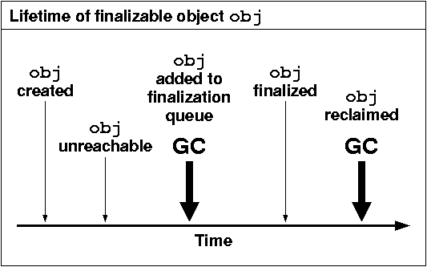
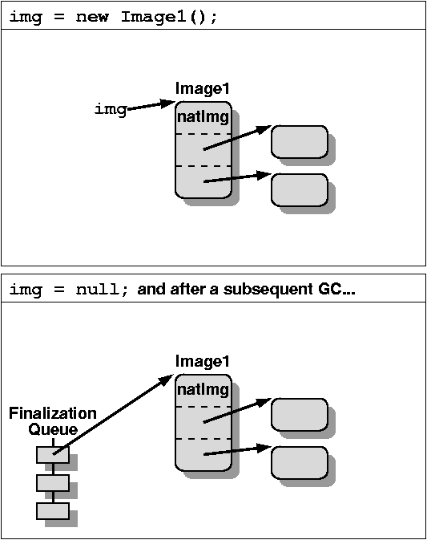
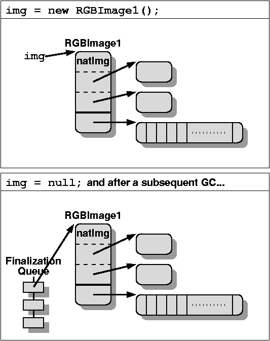
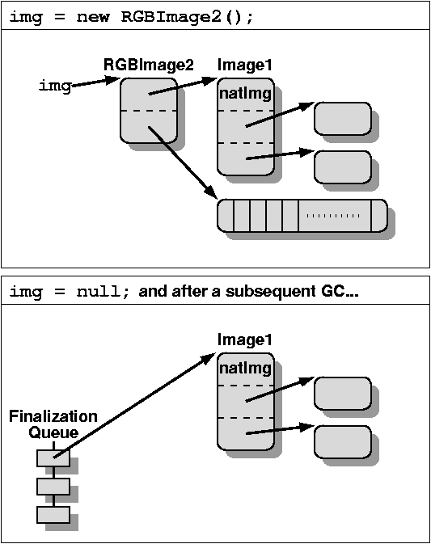
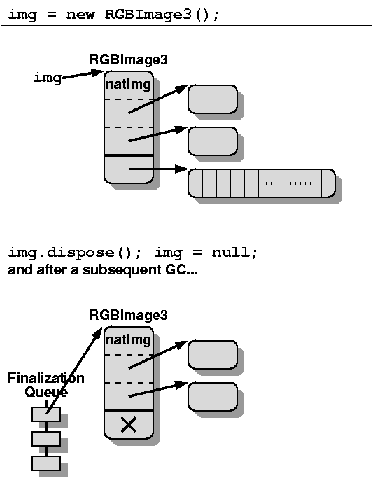
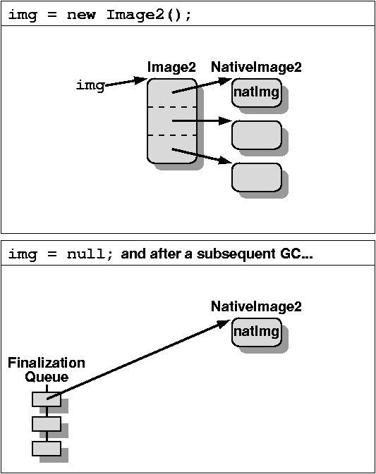
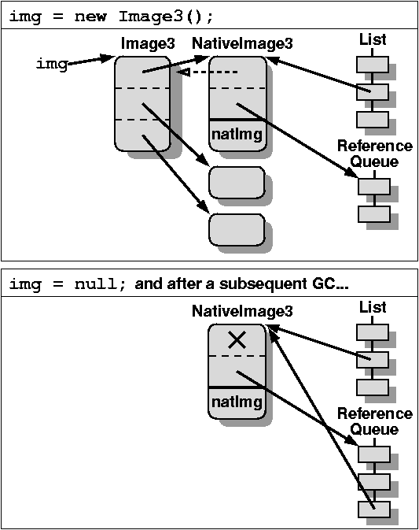

# 如何处理 Java 终结（Finalization）机制的内存保留问题

*作者：托尼·普林泰齐斯（Tony Printezis），2007 年 9 月*

[原文](https://www.oracle.com/technical-resources/articles/javase/finalization.html)

终结处理（Finalization's）是 Java 编程语言的一项特性，它允许你对垃圾回收器判定为不可达的对象执行善后清理操作。它通常用于回收与对象关联的本地资源。以下是一个简单的终结处理示例：

```
public class Image1 {

        // pointer to the native image data
        private int nativeImg;
        private Point pos;
        private Dimension dim;

        // it disposes of the native image;
        // successive calls to it will be ignored
        private native void disposeNative();
        public void dispose() { disposeNative(); }
        protected void finalize() { dispose(); }

        static private Image1 randomImg;
}
```

在一个 `Image1` 实例变得不可达之后的某个时间，Java 虚拟机（JVM）* 将调用其 `finalize()` 方法，以确保持有图像数据的本地资源（在示例中由整数 `nativeImg` 指向）已被回收。

然而，请注意， `finalize()` 方法尽管会被 JVM 特殊处理，但它是一个包含任意代码的任意方法。特别是，它可以访问对象中的任何字段 —— 在示例中即 `pos` 和 `dim` 。令人惊讶的是，它还可以通过某种方式（例如，让对象从一个静态字段可达）使对象再次变得可达，比如 `randomImg = this;` 。不建议采用后一种编程方式，但不幸的是，Java 编程语言允许这样做。

> 说明：因为静态变量为一种GC Root，所以在上述情况下，当 `randomImg = this` 时，此时this即为Image1，即Image1和某个GC Root关联了，因此Image1也变得可达了。

以下步骤和图 1 描述了可终结对象 `obj` 的生命周期 —— 即其类具有非平凡终结器的对象。



图 1. 可终结对象 obj 的生命周期。

1. 当分配 `obj` 时，JVM 会在内部记录 `obj` 是可终结的。这通常会减慢现代 JVM 原本快速的分配路径。

2. 当垃圾回收器确定 `obj` 不可达时，它会注意到 `obj` 是可终结的 —— 因为在分配时已记录这一点 —— 并将其添加到 JVM 的终结队列中。它还会确保从 `obj` 可达的所有对象都被保留，即使它们在其他情况下不可达，因为终结器可能会访问这些对象。图 2 展示了对象 `Image1` 的一个实例的这种情况。

   

   图 2. 垃圾回收器判定 obj 不可达。

3. 在稍后的某个时刻，JVM 的终结器线程将从队列中取出 `obj` ，调用其 `finalize()` 方法，并记录 `obj` 的终结器已被调用。此时， `obj` 被视为已完成终结处理。

4. 当垃圾回收器重新发现 `obj` 不可达时，它将回收其空间以及从它可达的所有对象的空间，前提是这些对象在其他情况下也是不可达的。

请注意，垃圾回收器至少需要两个周期才能回收 `obj` ，并且在此过程中需要保留从 `obj` 可访问的所有其他对象。如果程序员不小心，这可能会导致临时、细微且不可预测的资源保留问题。此外，Java 虚拟机（JVM）并不保证会调用所有已分配的可终结对象的终结方法。它可能会在垃圾回收器发现某些对象不可访问之前就退出。

#### 子类化时避免内存保留问题

即使你没有显式地使用终结方法，它也会延迟资源的回收。考虑以下示例：

```
public class RGBImage1 extends Image1 {

        private byte rgbData[];
}
```

`RGBImage1` 类继承自 `Image1` 并引入了字段 `rgbData` —— 示例中可能未展示某些方法。尽管你没有在 `RGBImage1` 上显式定义终结器，但该类自然会从 `Image1` 继承 `finalize()` 方法，并且所有 `RGBImage1` 实例也会被视为可终结的。当一个 `RGBImage1` 实例变得不可达时，对可能非常大的 `rgbData` 数组的回收将被延迟，直到该实例被终结，如图 3 所示。由于终结器可能“隐藏”在深层的类层次结构中，这个内存保留问题可能很难发现。



图 3. rgbData 数组的回收将延迟到实例被终结时进行。

避免这个问题的一种方法是重新安排代码，使其使用组合而非继承，如下所示：

```
public class RGBImage2 {

        private Image1 img;
        private byte rgbData[];

        public void dispose() {
                img.dispose();
        }
}
```

另请参阅约书亚·布洛克（Joshua Bloch）所著的《Effective Java 编程语言指南》第 4 章第 14 项：优先使用组合而非继承。

与 `RGBImage1` 相比， `RGBImage2` 包含一个 `Image1` 的实例，而不是继承 `Image1` 。当一个 `RGBImage2` 的实例变得不可达时，垃圾回收器会立即回收它，以及 `rgbData` 数组（假设后者在其他地方也不可达），并且只会将 `Image1` 实例放入终结队列，如图 4 所示。由于类 `RGBImage2` 不是 `Image1` 的子类，它不会继承 `Image1` 的任何方法。因此，你可能需要向 `RGBImage1` 添加委托方法来访问 `Image1` 的所需方法。 `dispose()` 方法就是这样一个例子。



图 4. 垃圾回收（GC）仅会将 Image1 实例排入终结处理队列。

然而，你并不总是能够按照刚刚描述的方式重新排列你的代码。有时候，作为该类的使用者，你必须做更多的工作，以确保该类的实例在被终结时不会占用超出必要的空间。以下代码展示了如何做到这一点：

```
public class RGBImage3 extends Image1 {

        private byte rgbData[];

        public void dispose() {
                rgbData = null;
                super.dispose();
        }
}
```

`RGBImage3` 与 `RGBImage1` 相同，但增加了 `dispose()` 方法，该方法会将 `rgbData` 字段置为 null。使用 `RGBImage3` 实例后，你需要显式调用 `dispose()` 以确保 `rgbData` 数组能及时被回收，如图 5 所示。显式地将字段置为 null 很少是好的做法，但这是少数合理的情况之一。



图 5. 使用 RGBImage3 实例后调用 dispose() 方法。

#### 保护用户免受内存保留问题的影响

本文介绍了在使用带有终结器的第三方类时如何避免内存保留问题。现在让我们来看看如何编写需要在对象销毁后进行清理的类，以使它们的用户不会遇到前面所述的问题。最好的方法是将此类类拆分为两个——一个用于保存需要在对象销毁后进行清理的数据，另一个用于保存其他所有内容——并且仅为前者定义一个终结器。以下代码演示了这种技术：

```
final class NativeImage2 {

        // pointer to the native image data
        private int nativeImg;

        // it disposes of the native image;
        // successive calls to it will be ignored
        private native void disposeNative();
        void dispose() { disposeNative(); }
        protected void finalize() { dispose(); }
}

public class Image2 {
        private NativeImage2 nativeImg;
        private Point pos;
        private Dimension dim;

        public void dispose() { nativeImg.dispose(); }
}
```

`Image2` 实例与 `Image1` 类似，但 `nativeImg` 字段包含在一个单独的类 `NativeImage2` 中。从图像类对 `nativeImg` 的所有访问都必须经过一层间接引用。然而，当一个 `Image2` 实例变得不可达时，只有 `NativeImage2` 实例会被排队等待终结处理。从 `Image2` 实例可达的其他任何内容都将被立即回收，如图 6 所示。类 `NativeImage2` 被声明为 `final` ，这样用户就不能对其进行子类化，从而避免重新引入本文之前描述的内存保留问题。



图 6. 当 Image2 实例变得不可达时，只有 NativeImage2 实例会被排队。

一个微妙的点是， `NativeImage2` 不应是 `Image2` 的内部类。内部类的实例会隐式引用创建它们的外部类实例。因此，如果 `NativeImage2` 是 `Image2` 的内部类，并且一个 `NativeImage2` 实例被排入终结队列，那么它也会保留对应的 `Image2` 实例，而这正是你要避免的情况。不过，假设 `NativeImage2` 类只能从 `Image2` 类访问。这就是它没有公共方法的原因。它的 `dispose()` 方法以及类本身都是包私有（package-private）的。

#### 终结机制的替代方案

前面的示例仍然存在一个不确定性来源：Java 虚拟机（JVM）并不保证会按照何种顺序调用终结队列中对象的终结方法。而且所有类（包括应用程序类、库类等）的终结方法都会被同等对待。因此，一个占用大量内存或稀缺本地资源的对象可能会在终结队列中被那些终结方法执行缓慢的对象阻塞 —— 这不一定是恶意行为，可能只是由于编程不严谨导致的。

为避免这种不确定性，你可以使用弱引用而非终结机制作为对象销毁后的通知机制。这样，你可以完全控制如何对本地资源的回收进行优先级排序，而不是依赖 JVM 来完成。以下示例展示了这种技术：

```
final class NativeImage3 extends WeakReference<Image3> {

        // pointer to the native image data
        private int nativeImg;

        // it disposes of the native image;
        // successive calls to it will be ignored
        private native void disposeNative();
        void dispose() {
                refList.remove(this);
                disposeNative();
        }

        static private ReferenceQueue<Image3> refQueue;
        static private List<NativeImage3> refList;
        static ReferenceQueue<Image3> referenceQueue() {
                return refQueue;
        }

        NativeImage3(Image3 img) {
                super(img, refQueue);
                refList.add(this);
        }
}

public class Image3 {
        private NativeImage3 nativeImg;
        private Point pos;
        private Dimension dim;

        public void dispose() { nativeImg.dispose(); }
}
```

`Image3` 与 `Image2` 相同。 `NativeImage3` 与 `NativeImage2` 类似，但它的事后清理依赖于弱引用而非终结机制。 `NativeImage3` 继承自 `WeakReference` ，其引用对象是关联的 `Image3` 实例。请记住，当引用对象（在这种情况下是 `WeakReference` ）的引用目标变得不可达时，该引用对象会被添加到与其关联的引用队列中。将 `nativeImg` 嵌入到引用对象本身可确保 JVM 准确地将所需内容入队，不会有多余的内容。参见图 7。同样，出于前面所述的原因， `NativeImage3` 不应是 `Image3` 的内部类。



图 7. 将 nativeImg 嵌入到引用对象本身。

你可以通过两种方式来确定垃圾回收器是否已经回收了引用对象的引用目标：显式方式，即调用引用对象的 `get()` 方法；或者隐式方式，即注意到引用对象已被加入关联的引用队列。此示例仅使用了后一种方式。

请注意，只有当引用对象本身是可达的时，垃圾回收器才会发现它们并将其添加到关联的引用队列中。否则，它们会像其他不可达对象一样被简单地回收。这就是为什么你要将所有 `NativeImage3` 实例添加到静态列表中 —— 实际上，任何数据结构都可以 —— 以确保当它们的引用对象变得不可达时，这些引用对象仍然是可达的并能被处理。当然，你还必须确保在处理完这些引用对象后将它们从列表中移除。这是在 `dispose()` 方法中完成的。

当在一个 `Image3` 实例上显式调用 `dispose()` 方法时，后续不会对该实例进行事后清理，因为没有必要。 `dispose()` 方法会将 `NativeImage3` 实例从静态列表中移除，这样当对应的 `Image3` 实例变得不可达时，`NativeImage3` 实例也将不可达。而且，如前所述，不可达的引用对象不会被添加到其对应的引用队列中。

相比之下，在之前所有使用终结处理的示例中，当可终结对象变得不可达时，无论你是否已显式释放其关联的本机资源，它们始终会被考虑进行终结处理。

JVM 将确保，当垃圾回收器发现一个 `Image3` 实例不可达时，它会将其对应的 `NativeImage3` 实例添加到关联的引用队列中。然后你必须将其从队列中取出并释放其本地资源。你可以使用以下方法来完成此操作，例如在一个“清理”线程上执行该方法：

```
static void drainRefQueueLoop() {

        ReferenceQueue<Image3> refQueue =
                NativeImage3.referenceQueue();
        while (true) {
                NativeImage3 nativeImg =
                        (NativeImage3) refQueue.remove();
                nativeImg.dispose();
        }
}
```

然而，在某些情况下，在应用程序中引入新线程可能并不容易，或者并非理想选择。在这种情况下，一种替代方法是在每次分配 `NativeImage3` 实例之前清空引用队列。你可以通过调用 `drainRefQueueBounded()` 方法来实现这一点，该方法是在 `NativeImage3` 构造函数之后执行的，这样在你需要分配新的原生图像之前，就可以释放一些已经可用的原生图像：

```
static final private int MAX_ITERATIONS = 2;

static void drainRefQueueBounded() {
        ReferenceQueue<Image3> refQueue =
                NativeImage3.referenceQueue();
        int iterations = 0;
        while (iterations < MAX_ITERATIONS) {
                NativeImage3 nativeImg =
                        (NativeImage3) refQueue.poll();
                if (nativeImg == null) {
                        break;
                }
                nativeImg.dispose();
                ++iterations;
        }
}
```

`drainRefQueueLoop()` 和 `drainRefQueueBounded()` 之间的主要区别在于，前者是一种无限操作 —— `remove()` 方法会阻塞，直到队列中有新的条目可用 —— 而后者执行的工作量是有界的。如果队列中没有条目， `poll()` 方法将返回 `null` ，并且该方法最多循环 `MAX_ITERATIONS` 次，因此如果引用队列非常长，它也不会花费任意长的时间。

之前的示例相当简单。经验丰富的开发者还可以根据对象处理的优先级需求，确保不同的引用对象与不同的引用队列相关联。并且 `drainRefQueueLoop()` 或 `drainRefQueueBounded()` 方法可以轮询所有可用的引用队列，并根据所需的优先级将对象出队。

虽然以这种方式清理资源显然比使用终结机制更为复杂，但它也更强大、更灵活，并且能最大程度减少与使用终结机制相关的不确定性。这也与 JVM 内部实际实现终结机制的方式非常相似。对于明确使用大量本地资源且在清理过程中需要更多控制的项目，建议采用这种方法。对于大多数其他项目，谨慎使用终结机制就足够了。

#### 仅在必要时使用终结处理

本文简要介绍了在 Java 虚拟机（JVM）中终结机制是如何实现的。接着给出了可终结对象如何会不必要地占用内存的示例，并概述了此类问题的解决方案。最后，介绍了一种使用弱引用而非终结机制的方法，该方法能让你以更灵活、可预测的方式进行对象销毁后的清理工作。

然而，完全依赖垃圾回收器来识别不可达对象，以便回收其关联的本地（且可能稀缺）资源存在一个严重缺陷：内存通常是充足的，用充足的资源来守护可能稀缺的资源并非良策。因此，当你使用一个已知关联有本地资源的对象时，例如图形用户界面（GUI）组件、文件或套接字，在使用完毕后务必调用其 `dispose()` 或等效方法。这将确保立即回收本地资源，并降低资源耗尽的可能性。因此，你应仅在万不得已时才使用本文讨论的事后清理方法，而不要将其作为主要的清理机制。

仅在绝对必要时才应使用终结机制。终结机制是一个不确定的——有时甚至是不可预测的——过程。你对它的依赖越少，它对 JVM 和你的应用程序的影响就越小。另请参阅 Joshua Bloch 所著的《Effective Java 编程语言指南》第 2 章第 6 项：避免使用终结方法。

注意：本文仅涵盖了使用终结机制时出现的两类问题：内存保留和资源保留问题。使用终结机制和 `Reference` 类还可能导致非常微妙的同步问题。

\* 本网站所使用的术语“Java 虚拟机”或“JVM”是指 Java 平台的虚拟机。

#### 如需更多信息

约书亚·布洛克（Joshua Bloch）。《Effective Java 编程语言指南》。艾迪生 - 韦斯利出版社（Addison - Wesley），2001 年。

#### 致谢

作者感谢彼得·凯斯勒（Peter Kessler）和布莱恩·戈茨（Brian Goetz）对本文提出的建设性意见。

本文的一个略有不同的版本于 2005 年 12 月 27 日发表在 DevX.com 上。


#### 关于作者

托尼·普林泰齐斯（Tony Printezis）是太阳微系统公司（Sun Microsystems）Java HotSpot 虚拟机开发团队的成员。他大部分时间都在从事动态内存管理方面的工作，专注于垃圾回收器的可扩展性、响应性、并行性和可视化。