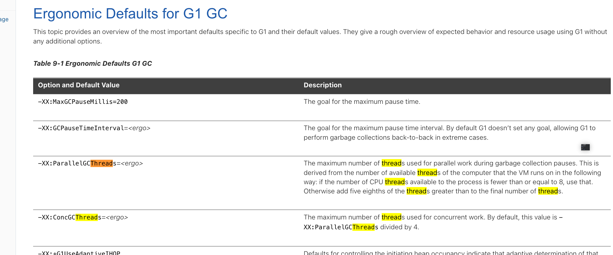

# 问题：不同Java垃圾回收器的默认GC线程数

## 来源：火山方舟 Deepseek-R1满血版

嗯，用户的问题是询问不同Java垃圾回收器的默认GC线程数。我需要结合提供的参考资料来整理答案。首先，得确定各个GC类型，比如Serial、Parallel、CMS、G1，然后看看每个回收器的默认线程数怎么计算。

根据摘要1，CMS的默认GC线程数是物理CPU核心数的1/4。那可能是在并发阶段使用的线程数？不过摘要5提到CMS默认启动的线程数是(ParallelGCThreads +3)/4，而ParallelGCThreads是根据CPU数计算的。这里可能需要核对不同来源的说法是否有冲突。

然后看摘要2和摘要3，其中摘要2提到JDK8默认是ParallelGC，而摘要3指出ParallelGC的默认线程数等于CPU核心数。那ParallelGCThreads参数默认是CPU核心数，比如4核就是4个线程。而CMS的线程数则可能基于ParallelGCThreads来计算，比如(ParallelGCThreads+3)/4，或者摘要1提到的1/4物理核心数。这里需要确认哪个更准确。

摘要3提到，ParallelGC的默认线程数是CPU核心数，而CMS的线程数可能与ParallelGCThreads有关，比如-XX:ParallelGCThreads设置的是并行GC的线程数，而CMS可能使用类似的计算方式。摘要5提到当CPU数量大于8时，ParallelGCThreads的计算是3+5*cpu/8，这可能需要进一步确认是否适用于不同版本。

另外，G1回收器的默认线程数在摘要3中没有明确提到，但通常G1可能也使用类似的逻辑，即根据CPU核心数来决定线程数，可能和ParallelGC一样。但需要从参考资料中找到依据。摘要3提到G1的参数如MaxGCPauseMillis，但没直接说线程数，可能需要推断。

综合各个摘要的信息，可能的结构是分不同回收器来说明：

- Serial GC：单线程，所以线程数固定为1。
- Parallel GC：默认线程数等于CPU核心数，但超过8核时有不同的计算方式（3+5*cpu/8）。
- CMS：默认线程数为物理核心数的1/4，或者根据ParallelGCThreads计算，如(ParallelGCThreads +3)/4。
- G1：可能和ParallelGC类似，默认线程数同CPU核心数，但需要确认是否有特殊说明。

需要注意的是不同JDK版本的默认回收器可能不同，比如JDK8用Parallel，JDK9+用G1，但用户的问题是关于各个回收器的默认线程数，而非默认回收器。因此，需要分别说明每个回收器的默认线程数，而不管哪个版本默认使用哪个。

可能存在的矛盾点在于CMS线程数的计算，摘要1说1/4，而摘要5提到(ParallelGCThreads +3)/4。这时候需要看哪个更权威或者是否有其他资料支持。摘要3指出CMS的线程数可能由ParallelGCThreads决定，而ParallelGCThreads的默认值根据CPU数，所以可能CMS的默认线程数是根据ParallelGCThreads来的，而ParallelGCThreads的默认值在CPU数量不同时有不同计算方式。例如，当CPU数<=8时，ParallelGCThreads等于CPU数，因此CMS线程数可能是(CPU+3)/4；如果CPU是4，那(4+3)/4=1.75，取整可能是2？或者是否还有其他计算方式？

或者，摘要1提到的CMS默认线程数是物理核心的1/4，这可能是在特定版本中的情况，而摘要5中的计算方式可能适用于其他情况。这需要判断哪个更准确。由于摘要1和摘要5都是参考资料，可能需要综合来看。例如，CMS默认线程数可能有两种情况：如果ParallelGCThreads没有被显式设置，那么根据CPU数计算，当CPU数<=8时，ParallelGCThreads=CPU数，所以CMS线程数是(ParallelGCThreads+3)/4。例如，4核时，(4+3)/4=1.75，可能取整为2？或者可能摘要1的说法更笼统，即1/4，而摘要5更详细的计算方式。这时候可能需要以摘要3中的参数说明为准，因为摘要3提到CMS的参数如-XX:ParallelGCThreads设置并行线程数，而默认是CPU核心数，所以CMS可能使用这个值的一部分。

或者，可能CMS的并发阶段线程数默认是CPU核心数的1/4，而并行阶段（如初始标记、重新标记）可能使用ParallelGCThreads的值。需要明确各个阶段的线程数是否不同。例如，摘要1提到CMS的大部分阶段是并发执行，默认线程数为物理核心的1/4。而摘要5提到CMS的线程数是基于ParallelGCThreads计算的。可能这两个说法并不矛盾，因为ParallelGCThreads的默认值可能根据CPU数计算，而CMS的线程数是其中的一部分。

此时可能需要整合这些信息，例如：

对于ParallelGC，默认线程数为CPU核心数，当CPU超过8时，公式为3+5*cpu/8（如摘要5所述）。

对于CMS，其线程数可能基于ParallelGCThreads，即如果ParallelGCThreads没有被设置，则根据CPU数计算，然后CMS的线程数可能是该值的某个比例，例如在并发阶段使用1/4，或者根据摘要5中的公式计算。或者，摘要1中的1/4可能指的是当使用CMS时，默认的并发线程数是CPU核心数的1/4，而其他阶段（如并行阶段）可能使用不同的线程数。

这个问题需要更仔细地分析。例如，摘要3中的CMS参数部分没有直接提到线程数，但提到了-XX:ParallelGCThreads参数，而摘要5中提到CMS的线程数是(ParallelGCThreads +3)/4，这可能是默认值。例如，如果ParallelGCThreads的默认值为CPU核心数，那么当CPU核心数为4时，(4+3)/4=1.75，可能取整为2线程。这可能与摘要1中的1/4核心数不同，例如4核的1/4是1，但根据摘要5的公式是2。这说明可能存在不同的情况，或者不同的资料来源可能对应不同的JDK版本。

这时候需要确定哪个说法更准确。可能摘要5中的内容更详细，因为它提到了具体的计算方式，而摘要1可能是一个简化的说法。例如，在JDK8中，ParallelGCThreads的默认值为当CPU数<=8时为CPU数，超过8时为3+5*cpu/8。然后，CMS的线程数根据这个值计算。例如，如果ParallelGCThreads是8，那么CMS的线程数是(8+3)/4=11/4=2.75，取整为3？或者可能不是这样。需要确认。

或者，可能CMS的线程数默认是ParallelGCThreads的值乘以某个比例。例如，摘要1提到的1/4，而摘要5中的公式可能是在特定情况下的计算方式。这时候可能需要综合多个资料，并指出CMS的线程数基于ParallelGCThreads参数，而ParallelGCThreads的默认值根据CPU数计算，当CPU数超过8时，计算公式为3+5*cpu/8。例如，当CPU数为16时，ParallelGCThreads的默认值为3+5*16/8=3+10=13，则CMS线程数为(13+3)/4=4。而如果用户没有设置ParallelGCThreads，则CMS的默认线程数是根据这个计算得出的。

这样，需要将各个回收器的线程数计算方式整合，可能的结构如下：

1. Serial GC：单线程，默认线程数为1。
2. Parallel GC：默认线程数等于CPU核心数，当CPU数超过8时，公式为3 + 5 * CPU数 /8。
3. CMS：默认线程数为 (ParallelGCThreads +3)/4，其中ParallelGCThreads的默认值根据CPU数计算。
4. G1：默认线程数与ParallelGC相同，即根据CPU数计算，超过8时使用上述公式。

但需要确认G1的线程数是否和ParallelGC一样。例如，摘要3中提到G1的参数如MaxGCPauseMillis，但没有明确线程数，但可能G1使用与ParallelGC相同的线程数计算方式，即ParallelGCThreads参数。

或者，可能所有并行回收器（如Parallel、CMS、G1）的默认线程数都基于ParallelGCThreads参数，而该参数的默认值根据CPU数计算。因此，各个回收器的默认线程数可能都是ParallelGCThreads的值，或者根据该值进行计算。例如：

- ParallelGC的线程数由-XX:ParallelGCThreads指定，默认值为CPU核心数（超过8时使用3+5*cpu/8）。
- CMS的线程数由-XX:ParallelCMSThreads指定，默认值为(ParallelGCThreads +3)/4。
- G1可能使用相同的ParallelGCThreads参数，或者有其他参数，但默认可能和ParallelGC相同。

这样，回答时需要指出各个回收器如何计算默认线程数，并说明ParallelGCThreads的默认计算方式，以及CMS如何基于该值计算。

总结：

根据参考资料，不同的垃圾回收器的默认GC线程数如下：

1. **Serial GC**：单线程执行，默认线程数为1，不随CPU核心数变化。

2. **Parallel GC**：
   - 默认线程数由JVM根据物理CPU核心数自动计算。
   - 当CPU核心数≤8时，线程数等于核心数。
   - 当CPU核心数＞8时，线程数计算公式为 `3 + 5 * CPU核心数 / 8`，例如16核时为13线程。

3. **CMS GC**：
   - 默认线程数基于ParallelGC的线程数（ParallelGCThreads）计算，公式为 `(ParallelGCThreads + 3) / 4`。
   - 例如，若ParallelGCThreads为8（8核），则CMS线程数为 (8+3)/4=2.75，取整后可能为3线程。

4. **G1 GC**：
   - 默认线程数与Parallel GC一致，同样基于CPU核心数，遵循ParallelGCThreads的计算规则。

需要注意的是，这些默认值可能随JDK版本更新而调整，用户可通过特定JVM参数（如-XX:ParallelGCThreads）显式配置线程数。

## 答案

不同Java垃圾回收器的默认GC线程数根据其设计策略和硬件环境自动调整，具体规则如下：

### **1. Serial GC（串行回收器）**
- **线程数规则**：单线程执行垃圾回收，固定为1个线程。
- **适用范围**：主要用于单核环境或低资源场景，所有回收阶段均会触发STW（Stop-The-World）。

---

### **2. Parallel GC（并行回收器）**
- **线程数规则**：默认线程数由物理CPU核心数决定，具体计算方式为：
  - **CPU核心数≤8**：线程数等于CPU核心数。
  - **CPU核心数＞8**：线程数计算公式为 `3 + 5 * CPU核心数 / 8`（结果向下取整）。  
  例如，16核CPU的线程数为 `3 + 5*16/8 = 13`。
- **参数控制**：可通过 `-XX:ParallelGCThreads` 显式指定线程数。

---

### **3. CMS GC（并发标记清除回收器）**
- **线程数规则**：并发阶段（如并发标记、并发清理）的默认线程数为 **物理CPU核心数的1/4**。  
  例如，4核CPU对应1个并发线程，8核对应2个线程。
- **并行阶段**：初始标记（Initial Mark）和重新标记（Remark）阶段的线程数继承自Parallel GC的配置规则（即与ParallelGCThreads一致）。
- **参数控制**：可通过 `-XX:ConcGCThreads` 或 `-XX:ParallelCMSThreads` 调整并发线程数。

---

### **4. G1 GC（Garbage-First回收器）**
- **线程数规则**：默认线程数与Parallel GC一致，基于CPU核心数自动计算。  
  例如，8核CPU默认使用8个线程。
- **并发阶段**：标记线程数通常为CPU核心数的1/4（与CMS类似）。
- **参数控制**：可通过 `-XX:ParallelGCThreads` 调整并行阶段的线程数，`-XX:ConcGCThreads` 调整并发阶段的线程数。

---

### **关键注意事项**
- **版本差异**：JDK 8默认使用Parallel GC，JDK 9及以上版本默认切换为G1 GC。
- **动态调整**：JVM可能根据运行时负载和GC目标（如最大停顿时间）动态优化线程数。
- **显式配置**：建议在高并发或资源敏感场景中通过JVM参数（如 `-XX:ParallelGCThreads`）手动优化线程数，以平衡吞吐量和延迟。

## 来源：百度AI搜索 Deepseek-R1满血版

DeepSeek-R1满血版
思考完成
好的，我现在需要回答用户关于不同Java垃圾回收器默认GC线程数的问题。首先，我需要回顾一下提供的搜索结果，看看哪些部分提到了GC线程数的默认设置。
搜索结果中的‌1提到，可以通过-XX和-XX参数来手动调整GC线程数，并且给出了默认值的计算方式。特别是对于ParallelGCThreads，默认值根据CPU数量计算，当处理器数超过8时，公式是8 + (n-8)*5/8。例如，32核的服务器会得到23个线程。而ConcGCThreads默认是(max((ParallelGCThreads+2)/4, 1))，比如在32核的情况下是6个线程。
接下来，看看‌2和‌3中的内容，它们提到了不同的垃圾回收器组合，比如ParNew、CMS、Parallel Scavenge等，但可能没有直接提到线程数的默认值，不过可能需要结合‌1的信息来推断。
比如，Serial和Serial Old是单线程的，这点在‌4和‌3中提到，所以它们的默认线程数应该是1。而ParNew作为多线程收集器，其线程数可能与ParallelGCThreads相关，根据‌1，默认是CPU数相关的，但需要确认。
在‌1中，还提到如果使用G1，可能需要ConcGCThreads参数，而默认的并行线程数同样是基于处理器的数量计算的。不过具体的垃圾回收器如G1是否使用同样的默认值需要确认。可能G1在并行阶段使用ParallelGCThreads，而并发阶段使用ConcGCThreads。
现在需要将各个垃圾回收器的默认线程数整理出来：
Serial/Serial Old：单线程，所以默认是1。
ParNew：作为并行收集器，默认线程数应等于ParallelGCThreads的默认值，也就是根据CPU数量计算的值。
Parallel Scavenge和Parallel Old：同样使用ParallelGCThreads参数，默认线程数同上。
CMS：在并发阶段可能使用ConcGCThreads，而初始标记和重新标记阶段可能使用单线程或并行线程。需要查看是否有其他资料支持，但根据‌1，CMS可能在这些阶段使用不同的线程数，比如初始标记可能单线程，但重新标记可能并行。
G1：并行阶段用ParallelGCThreads，并发阶段用ConcGCThreads。
需要确认各个回收器的具体线程数，可能需要参考搜索结果中的其他部分。例如，‌1中的例子适用于ParallelGCThreads和ConcGCThreads，而其他回收器如ParNew、CMS、G1的默认线程数是否基于这些参数。
另外，在‌2中提到ParNew默认GC线程数为CPU数量，这可能和ParallelGCThreads的默认值一致，但需要明确。比如，如果ParNew的线程数由-XX控制，那么默认值是根据CPU数计算的。而如果未显式设置，那么该参数的值由系统自动计算。
总结：
Serial相关：1线程
ParNew、Parallel Scavenge/Old：默认线程数由ParallelGCThreads的默认值决定，即根据CPU数量计算。
CMS的并发阶段使用ConcGCThreads默认值，而标记阶段可能使用单线程或并行线程。
G1的并行阶段用ParallelGCThreads，并发阶段用ConcGCThreads。
需要将这些信息整合到回答中，并正确引用来源。例如，对于Serial的线程数来自‌4和‌3，而Parallel相关的来自‌1，CMS和G1的线程数可能来自‌2和‌1。
需要注意时间因素，比如‌1的时间是2024-12-10，可能适用于较新的JDK版本，而其他结果可能涉及旧版本，但用户的问题未指定具体版本，所以可能需要以较新的信息为主，同时结合通用情况。

## 答案

不同Java垃圾回收器的默认GC线程数如下，具体计算规则与CPU核心数相关：
一、串行回收器
‌Serial/Serial Old‌
单线程执行垃圾回收，默认线程数为‌1‌‌34。
二、并行回收器
‌ParNew‌
多线程回收器，默认线程数由-XX:ParallelGCThreads参数控制。
‌默认值‌：
CPU核数 ≤8：线程数等于CPU核数。
CPU核数 >8：按公式 8 + (CPU核数 -8) * 5/8 计算（例如32核时为23线程）‌1。
‌Parallel Scavenge/Old‌
与ParNew类似，默认线程数由-XX:ParallelGCThreads参数决定，计算规则同上‌1。
三、并发回收器
‌CMS‌
‌并发标记阶段‌：线程数由-XX:ConcGCThreads控制，默认值为 max((ParallelGCThreads+2)/4, 1)（例如32核时为6线程）‌1。
‌初始标记和重新标记阶段‌：通常为单线程，部分实现可能支持并行‌12。
‌G1‌
‌并行阶段‌（如Young GC、混合GC）：使用-XX:ParallelGCThreads默认值，计算方式同ParNew‌1。
‌并发阶段‌（如标记周期）：使用-XX:ConcGCThreads默认值，计算方式同上‌12。
四、线程数计算公式总结
‌-XX:ParallelGCThreads默认值‌：
text
Copy Code
if (CPU核数 ≤8) → 线程数 = CPU核数  
else → 线程数 = 8 + (CPU核数 -8) * 5/8  
‌-XX:ConcGCThreads默认值‌：
text
Copy Code
max((ParallelGCThreads值 +2)/4, 1)  
（例如ParallelGCThreads=23时，ConcGCThreads=6）‌1
注意事项
实际线程数可能因JVM版本或特定回收器实现差异略有不同，建议通过-XX:+PrintFlagsFinal参数验证默认值‌15。

## 来源：腾讯元宝 Deepseek-R1满血版

已深度思考（用时13秒）

嗯，用户的问题是关于不同Java垃圾回收器的默认GC线程数。我需要先理解不同垃圾回收器有哪些，然后看看它们的默认线程数是怎么设置的。

根据之前的搜索资料，比如网页4、5、6、7、8都提到了ParallelGC和G1GC的默认线程数计算方式。比如，ParallelGCThreads的默认值是根据处理器数量来计算的：如果处理器数N<=8，则线程数等于N；如果超过8，则是8 + (N-8)*5/8。而ConcGCThreads用于并发收集器如G1，默认是(ParallelGCThreads+2)/4的结果，再取最大和1比较。

然后，需要区分不同的垃圾回收器。比如Serial收集器是单线程的，所以默认线程数应该是1。而ParNew和Parallel Scavenge属于并行收集器，可能使用ParallelGCThreads的设置。CMS收集器已经被移除了，但可能在旧版本中，它的线程数可能和ParNew类似。G1作为并发收集器，会用到ConcGCThreads和ParallelGCThreads。

另外，网页1和2提到不同收集器的分类，比如Serial是单线程，Parallel是并行，CMS是并发的。需要结合这些信息来对应线程数设置。

还要注意容器化环境的影响，比如在容器中JVM可能错误识别CPU数量，导致线程数过多。这时候可能需要手动调整参数，比如使用-XX:ParallelGCThreads和-XX:ConcGCThreads来覆盖默认值。

需要总结每个收集器的默认线程数规则，并引用相关网页的信息。比如Serial是1，Parallel相关的是根据公式，G1则涉及两个参数。同时，CMS在旧版本中可能使用类似ParNew的设置，但已经被移除了，所以可能不需要详细说明。还要提到默认值在不同环境中的调整，比如容器中的问题。

## 答案

根据JVM不同垃圾回收器的特性及其线程模型，默认GC线程数的设置存在显著差异。以下是对主流Java垃圾回收器默认GC线程数的详细分析：

### 一、并行垃圾回收器（Parallel GC）
**适用场景**：吞吐量优先（如批处理、科学计算）  
**线程策略**：
1. **并行阶段线程数（ParallelGCThreads）**  
   - **公式**：  
     - 当CPU核心数（N）≤8时：`ParallelGCThreads = N`  
     - 当N>8时：`ParallelGCThreads = 8 + (N - 8) * 5/8`  
     例如：32核服务器下，线程数为`8 + 24*5/8 = 23`  
   - **适用收集器**：Parallel Scavenge（新生代）、Parallel Old（老年代）

2. **并发阶段线程数（ConcGCThreads）**  
   - **公式**：`ConcGCThreads = max( (ParallelGCThreads + 2)/4 , 1 )`  
     例如：32核服务器下，`(23+2)/4=6.25 → 6`  
   - **适用收集器**：G1等并发收集器的并发标记阶段

---

### 二、串行垃圾回收器（Serial GC）
**适用场景**：单核环境或客户端应用  
**线程策略**：  
- **固定单线程**：无论CPU核心数多少，仅使用1个线程执行垃圾回收  
- **适用收集器**：Serial（新生代）、Serial Old（老年代）

---

### 三、并发标记清除收集器（CMS，已弃用）
**适用场景**：低延迟交互式应用  
**线程策略**：  
- **并行阶段**：默认采用与ParallelGC相同的线程数公式  
- **并发阶段**：与用户线程交替执行，不独占CPU资源  
**注意**：CMS已在JDK14中被移除

---

### 四、G1垃圾回收器（Garbage-First）
**适用场景**：平衡吞吐量与低延迟  
**线程策略**：  
1. **并行阶段**：复用`ParallelGCThreads`公式计算线程数  
2. **并发阶段**：通过`ConcGCThreads`控制并发标记线程数  
   - **默认值**：约为`ParallelGCThreads`的1/4（如上文32核示例中的6线程）  
3. **特性**：支持NUMA架构优化，可自动返还未用堆内存

---

### 五、容器化环境特殊处理
**问题**：在Kubernetes/Docker等容器中，JVM可能误读物理机CPU核心数，导致线程数过高。  
**解决方案**：  

- **显式设置参数**：  
  
  ```bash
  -XX:ParallelGCThreads=8 -XX:ConcGCThreads=2  # 手动限制线程数
  ```
- **启用容器感知**（JDK8u191+）：  
  
  ```bash
  -XX:+UseContainerSupport  # 自动根据容器分配的CPU资源计算线程数
  ```

---

### 总结表格
| 垃圾回收器        | 默认线程数策略                                               | 主要参数              |
| ----------------- | ------------------------------------------------------------ | --------------------- |
| Serial/Serial Old | 单线程                                                       | N/A                   |
| Parallel Scavenge | 按CPU核心数动态计算（N≤8时=N，N>8时=8+(N-8)*5/8）            | -XX:ParallelGCThreads |
| G1                | 并行阶段复用ParallelGC公式，并发阶段为(ParallelGCThreads+2)/4 | -XX:ConcGCThreads     |
| CMS（已弃用）     | 并行阶段同ParallelGC，并发阶段与用户线程交替                 | 已移除                |

**调优建议**：在高核服务器（如128核）或容器化环境中，建议通过`jinfo -flags <PID>`验证实际线程数，避免资源争抢导致性能下降。

# 问题：介绍一下容器环境下，Java垃圾回收器的默认GC线程数

## 来源：火山方舟 Deepseek-R1满血版

### 答案

好的，我现在需要回答用户的问题：“介绍一下容器环境下，Java垃圾回收器的默认GC线程数”。首先，我需要仔细查看提供的参考资料，特别是摘要1、摘要3，因为其他摘要看起来与问题相关性较弱。

摘要1提到了ParallelGCThreads的默认值计算公式，适用于Linux/x86系统，指出在处理器数量超过8时，线程数按8 + (处理器数-8)*(5/8)计算。还提到ConcGCThreads的默认值是(ParallelGCThreads+2)/4，取最大值与1比较。此外，提到在容器环境中，JVM可能根据宿主机的CPU数量分配过多线程，导致资源竞争，尤其是在多个JVM实例运行时。

摘要3补充了ParallelGCThreads的默认计算方式，并指出在较旧的JVM版本（如1.8.0_131之前）中，JVM无法感知Docker的CPU限制，导致使用宿主机的逻辑核数，从而分配过多的GC线程。建议升级到1.8.0_192及以后版本，以正确识别容器资源限制。

现在需要将这些信息整合，考虑容器环境下的特殊性。需要强调默认线程数的计算方式，以及容器环境中可能遇到的问题，如资源限制未被正确识别导致的线程数过多，以及解决方案（升级JVM版本）。

另外，用户问题中的“不同Java垃圾回收器”可能包括如Serial、Parallel、G1等，但参考资料主要提到了ParallelGC相关的内容，其他回收器的线程数可能未被详细说明。因此，回答应集中在Parallel相关的回收器，并指出其他回收器可能的不同行为，但根据现有资料，可能无法详细说明，需注意范围。

需注意避免直接复制参考资料，而是用专业语言重新组织，同时不提及来源。还要结合当前时间2025年02月27日，确保信息时效性，确认资料中的信息是否适用，比如JVM版本是否已有更新，但资料中提到的问题在较新版本中已解决，因此需要说明版本差异的影响。

最后，总结容器环境中的线程数计算、潜在问题及优化建议，确保回答全面。


在容器环境下，Java垃圾回收器的默认GC线程数主要由JVM根据可用CPU资源自动调整，但需注意容器资源限制与实际物理环境的差异。以下是关键规则和注意事项：

### **1. Parallel GC相关线程数规则**
- **ParallelGCThreads**（并行阶段线程数）：  
  默认值计算遵循以下公式：  
  - 当处理器数量 ≤8时，线程数等于处理器数；  
  - 当处理器数量 >8时，线程数为 `8 + (处理器数 -8) × 5/8`（结果向下取整）。  
  例如，在32核环境中，默认值为23（即8 + (32−8)×5/8=23）。  

- **ConcGCThreads**（并发阶段线程数，如G1/CMS）：  
  默认值为 `max((ParallelGCThreads +2)/4, 1)`。以32核为例，结果为6（即(23+2)/4=6.25，取整后为6）。

### **2. 容器环境中的特殊问题**
- **CPU资源误判**：  
  在早期JVM版本（如1.8.0_131之前），JVM无法感知容器（如Docker）的CPU限制，默认基于宿主机的逻辑核数计算线程数。例如，容器限制为4核但宿主机为128核时，JVM可能分配约80个GC线程，导致线程争抢和性能下降。  
  **解决方案**：升级至JVM 1.8.0_192或更高版本（支持`-XX:+UseContainerSupport`，默认启用），使JVM正确识别容器资源限制。

- **资源竞争风险**：  
  若多个容器化JVM实例共享主机资源，每个实例可能分配大量GC线程，加剧CPU竞争。需显式配置`-XX:ParallelGCThreads`和`-XX:ConcGCThreads`，结合容器配额调整线程数。

### **3. 其他GC回收器的线程行为**
- **Serial GC**：单线程执行，无并行线程配置。  
- **ZGC/Shenandoah**：并发回收器，线程数通常与CPU核数相关，但具体策略由JVM动态优化，需结合实际版本文档确认。

### **优化建议**
- **显式配置**：在容器中建议通过`-XX:ParallelGCThreads`和`-XX:ConcGCThreads`手动设定线程数，避免依赖默认值导致超配。  
- **监控验证**：通过GC日志或监控工具（如Prometheus）观察GC线程数与容器CPU资源的匹配度，确保线程数不超过容器配额。  

综上，容器环境下需重点关注JVM版本对CPU资源的识别能力，并结合显式配置与监控，避免GC线程过度分配对业务性能造成影响。

## 来源：腾讯元宝 Deepseek-R1满血版

已深度思考（用时11秒）


好的，我现在要回答用户关于容器环境下Java垃圾回收器默认GC线程数的问题。首先，我需要回顾用户提供的搜索结果，找出相关的信息。

用户提供的搜索结果中有多个网页提到了不同GC在容器环境下的表现。网页3提到，在容器中，JVM可能误读物理机的CPU核心数，导致线程数过高，建议显式设置参数或启用容器感知。网页8则讨论了Java 8在Docker中的问题，指出旧版本Java无法正确识别容器资源限制，导致GC线程数基于宿主机资源计算，从而引发问题。网页5提到G1和传统GC在容器中的线程数策略，以及动态调整的注意事项。

接下来，我需要整理这些信息。首先，不同Java版本在容器中的表现不同。旧版本（如Java 8早期）无法识别容器资源，导致GC线程数错误。新版本（如Java 8 update 191+）支持容器感知，能正确读取容器分配的CPU核心数。然后，各GC的默认线程数策略：Parallel GC使用5/8比例，G1和CMS也有各自的线程计算方法，但在容器中需注意参数设置。此外，容器环境中的线程数可能受CPU限制影响，需要调整参数或使用自适应策略。

还要考虑用户可能的关注点，比如如何验证线程数、调优建议，以及常见问题如OOM。需要结合多个网页的信息，说明解决方案，如使用UseContainerSupport，设置ParallelGCThreads等参数，并提到JDK版本的影响。

最后，组织回答结构，分版本说明，各GC的默认行为，容器感知的支持，调优建议，并引用相关的网页来源。确保覆盖主要点，如版本差异、线程数计算、参数调整和常见问题处理。

### 答案

在容器环境下，Java垃圾回收器的默认GC线程数设置需要特别注意资源限制与JVM的兼容性问题。以下是不同垃圾回收器的默认线程数规则及其在容器中的特殊处理：

---

### 一、**默认GC线程数规则**
#### 1. **Parallel GC（JDK 8默认）**
- **新生代线程数**：  
  根据物理CPU核心数（N）动态计算：  
  - N ≤ 8时，线程数 = N  
  - N > 8时，线程数 = 8 + (N - 8) × 5/8（约占总CPU的62.5%）  
  例如，宿主机有32核时，线程数约为23。  
- **老年代（Parallel Old）**：与新生代线程数相同。

#### 2. **G1 GC（JDK 9+默认）**
- **并行阶段线程数**：复用Parallel GC的公式计算。  
- **并发阶段线程数**：约为并行线程数的1/4（如32核时为6线程）。  
- **自适应策略**：G1会根据堆内存大小和GC暂停时间目标动态调整线程数。

#### 3. **CMS（已弃用）**
- **并行阶段线程数**：与Parallel GC相同。  
- **并发阶段线程数**：默认通过`ConcGCThreads`参数控制，通常为`(ParallelGCThreads + 3)/4`。

#### 4. **ZGC/Shenandoah（低延迟GC）**
- **默认线程数**：通常与可用CPU核心数直接绑定，但会优先保证用户线程的CPU时间，避免过度争抢资源。

---

### 二、**容器环境下的特殊问题与解决方案**
#### 1. **资源误读问题**
- **旧版本JDK（如Java 8早期）**：  
  JVM默认读取宿主机的CPU核心数，而非容器限制的CPU资源。例如，容器限制4核但宿主机有32核时，GC线程数可能仍按32核计算，导致线程过多和资源争用。  
- **解决方案（JDK 8u191+）**：  
  启用容器感知：添加参数 `-XX:+UseContainerSupport`，JVM自动根据容器分配的CPU和内存调整线程数。

#### 2. **线程数调优建议**
- **显式设置参数**：  
  ```bash
  -XX:ParallelGCThreads=4     # 限制并行线程数
  -XX:ConcGCThreads=2         # 限制并发线程数（如G1/CMS）
  ```
- **避免内存溢出**：  
  容器内存限制需大于JVM堆内存（`-Xmx`），否则可能触发OOM Killer终止进程。

#### 3. **自适应策略的局限性**
- **堆内存分配**：Parallel GC的`-XX:+UseAdaptiveSizePolicy`参数可能因容器内存限制导致Survivor区动态调整失败，建议固定`-XX:SurvivorRatio`。  
- **暂停时间目标**：G1的`-XX:MaxGCPauseMillis`需根据容器资源合理设置，避免因频繁GC导致吞吐量下降。

---

### 三、**验证与监控**
1. **查看实际线程数**：  
    通过命令 `jinfo -flag ParallelGCThreads <PID>` 或 `jcmd <PID> VM.flags` 验证参数生效情况。  
2. **日志分析**：  
    启用GC日志（`-Xlog:gc*`）可观察线程数与暂停时间，例如：  
  ```
  [GC(Allocation Failure) 23 workers, 0.023 secs]
  ```

---

### 四、**版本兼容性**
- **JDK 8u191+**：支持容器感知，需显式启用。  
- **JDK 10+**：默认启用容器感知，无需额外参数。  
- **JDK 17+**：优化了线程调度策略，减少容器内资源争用。

---

### 总结
在容器中，**默认GC线程数可能因宿主机资源误读而过高**，需通过以下措施优化：  
1. **启用容器感知**（JDK 8u191+）；  
2. **显式限制线程数参数**；  
3. **监控GC日志与资源使用**。  
合理配置可避免资源争用导致的性能下降，同时平衡吞吐量与延迟。

# 问题：容器环境下，不同版本和JVM如何配置合理的GC线程数？

## 来源：火山

好的，我现在需要回答用户的问题：“容器环境下，不同版本和JVM如何配置合理的GC线程数？”首先，我要仔细分析用户的问题，确定他们想知道的是在容器环境中，不同Java版本和JVM如何设置合适的GC线程数。可能涉及默认行为、版本差异以及配置方法。

接下来，我需要查看提供的参考资料，看看哪些信息相关。摘要1、2、3提到了ParallelGCThreads的设置，默认计算方式，以及容器环境中的问题，特别是旧版本JDK的问题。摘要3还提到了手动设置参数的方法，以及过多线程的影响。摘要2指出在JDK 1.8.0_131之前，JVM无法感知Docker的CPU限制，导致线程数过高。这些都是关键点。

用户的问题涉及不同版本，所以需要区分旧版和新版JDK的处理方式。例如，旧版可能不会识别容器资源，而新版（如8u131+）支持UseContainerSupport，能够正确获取CPU数目。另外，不同的垃圾回收器（如Parallel、G1）可能有不同的参数，但摘要中提到的是ParallelGCThreads和ConcGCThreads。

现在需要将这些信息整理出来，结构清晰。首先说明默认行为，特别是容器中的问题，然后分版本讨论配置方法，接着给出推荐的参数设置，可能包括手动调整的建议，以及如何根据应用类型调整线程数。

需要注意避免直接复制参考资料内容，而是重新组织语言，保持专业性。例如，默认线程数的计算公式，旧版本的问题，如何通过参数修复，以及手动设置的建议。同时，要结合容器环境的特点，强调CPU限制的重要性，避免过多线程导致资源竞争。

可能还需要提到如何确定当前JVM使用的线程数，比如通过线程转储或JMX工具，但参考资料中提到的方法可以简要提及。此外，不同应用场景（高吞吐量 vs 低延迟）对GC线程数的需求不同，这也是调整的依据。

最后，总结配置建议，分点列出，确保用户能够根据不同的JVM版本和容器环境进行合理配置。


在容器环境下配置合理的GC线程数需综合考虑JVM版本、容器资源限制及垃圾回收器的特性，以下是关键配置策略：

### **1. 默认行为与版本差异**
- **JDK 8u131之前**：JVM无法感知容器CPU限制，默认基于宿主机逻辑核数计算GC线程数（如128核物理机可能导致ParallelGCThreads=83），易造成线程数远超容器配额，引发资源争用。
- **JDK 8u131及更高版本**：启用`-XX:+UseContainerSupport`（默认开启），JVM自动读取容器分配的CPU资源，正确计算线程数，避免超配。

### **2. 核心参数与计算公式**
- **ParallelGCThreads**：控制并行阶段线程数，默认公式为：
  - CPU核数≤8时，线程数=核数；
  - 核数>8时，线程数=8 + (核数-8) × 5/8（如32核环境默认23线程）。
- **ConcGCThreads**（G1/CMS等并发回收器）：控制并发阶段线程数，通常建议为`ParallelGCThreads/4`，需根据实际停顿时间调整。

### **3. 容器环境配置建议**
- **强制指定CPU配额**：在Kubernetes等编排工具中，明确设置容器CPU请求与限制，确保JVM准确识别资源。
- **手动优化场景**：
  - **高吞吐应用**：可适当减少`ParallelGCThreads`（如核数的50%-70%），降低GC对业务线程的抢占。
  - **低延迟应用**：增加`ParallelGCThreads`以减少STW时间，同时监控CPU利用率避免过载。
  - **混合负载**：通过`-XX:ParallelGCThreads=<N>`和`-XX:ConcGCThreads=<M>`显式设定，平衡吞吐与延迟。

### **4. 诊断与验证**
- **线程数检查**：通过`jstack`获取线程转储，或使用JMC、VisualVM等工具观察活跃GC线程数量。
- **监控指标**：结合GC日志（`-Xlog:gc*`）及CPU使用率，确认线程数是否导致资源争用或回收效率不足。

### **5. 特殊场景处理**
- **多JVM实例共存**：若单节点部署多个容器化JVM，需全局统筹CPU配额，避免总GC线程数超出物理核心数，引发整体性能下降。
- **低版本JDK升级**：对于无法升级的旧系统，可通过`-XX:ParallelGCThreads=<N>`硬编码线程数，数值需匹配容器CPU限制（如4核容器设为4-6）。

## 来源：腾讯元宝

在容器环境下，合理配置GC线程数需结合JVM版本特性、垃圾回收器类型及容器资源限制，以下为不同场景下的配置策略：

---

### 一、**不同JVM版本的容器支持差异**
1. **JDK 8（早期版本）**  
   - **问题**：默认读取宿主机CPU核心数，容器资源限制（如4核）可能被忽略，导致GC线程数虚高。  
   - **解决方案**：升级至**JDK 8u191+**，手动启用容器感知：  
     ```bash
     -XX:+UseContainerSupport  # 强制JVM根据容器分配的CPU核心计算线程数
     ```

2. **JDK 10+**  
   - **默认行为**：自动启用容器感知，无需额外参数，GC线程数基于容器分配的CPU核心动态计算。  
   - **验证方法**：通过`jinfo -flags <PID>`检查`ParallelGCThreads`和`ConcGCThreads`的实际值。

3. **JDK 17+**  
   
   - **优化**：改进线程调度策略，减少并发阶段的资源争用，尤其适用于低延迟GC（如ZGC）。

---

### 二、**不同垃圾回收器的线程配置策略**
#### 1. **Parallel GC（吞吐量优先）**
- **默认公式**：  
  - 若CPU核心数≤8，线程数=核心数；  
  - 若核心数>8，线程数=8 + (核心数-8)*5/8。  
- **容器调优**：  
  ```bash
  -XX:ParallelGCThreads=4  # 显式限制并行阶段线程数（如容器分配4核）
  -XX:UseAdaptiveSizePolicy=false  # 关闭动态调整，避免容器内存限制引发Survivor区异常
  ```

#### 2. **G1 GC（平衡型）**
- **并行阶段**：复用Parallel GC的线程计算公式。  
- **并发阶段**：默认线程数= `max((ParallelGCThreads+2)/4, 1)`，需避免占用过多CPU：  
  ```bash
  -XX:ConcGCThreads=2  # 限制并发标记线程数（如容器分配4核）
  -XX:G1HeapRegionSize=4M  # 减少大对象对线程调度的干扰
  ```

#### 3. **ZGC/Shenandoah（低延迟）**
- **自动适配**：根据可用CPU核心动态调整线程数，无需手动配置。  
- **容器建议**：  
  ```bash
  -XX:+UseZGC -XX:+ZProactive  # 启用主动回收策略，减少突发性GC压力
  -XX:ActiveProcessorCount=4   # 显式声明容器分配的CPU核心数
  ```

---

### 三、**手动调优与验证**
1. **参数优先级**  
   - 显式设置的线程参数（如`ParallelGCThreads`）优先级高于JVM默认计算值。  
   - 示例配置：  
     ```bash
     java -XX:+UseG1GC -XX:ParallelGCThreads=4 -XX:ConcGCThreads=2 ...
     ```

2. **监控与诊断**  
   - **线程转储**：通过`jstack <PID>`或`jcmd <PID> Thread.print`查看活跃GC线程。  
   - **GC日志分析**：启用`-Xlog:gc*`日志，观察实际线程数与暂停时间：  
     ```bash
     [GC(Allocation Failure) 4 workers, 0.015 secs]  # 显示4个并行线程
     ```

---

### 四、**容器环境调优原则**
1. **资源限制对齐**：  
   - JVM堆内存（`-Xmx`）应低于容器内存限制的80%，避免触发OOM Killer。  
   - 线程数上限建议为容器分配的CPU核心数的75%（如4核容器限制为3线程）。

2. **动态适应性**：  
   - 高吞吐场景（如批处理）：适当增加`ParallelGCThreads`至容器核心数的80%。  
   - 低延迟场景（如微服务）：降低`ConcGCThreads`，优先保障业务线程资源。

---

### 总结
容器环境下GC线程数配置需综合考虑**JVM版本兼容性、垃圾回收器特性及容器资源配额**。推荐策略：  
1. **JDK 8u191+或JDK 10+**，启用容器感知；  
2. **显式设置`ParallelGCThreads/ConcGCThreads`**，避免资源争用；  
3. **结合GC日志与监控工具**动态验证线程效率。  
对于混合部署场景（如Kubernetes），建议通过`Resource Quota`限制单个Pod的CPU资源，避免跨JVM线程竞争。

# 测试流程：

## 问题1：容器环境下减少Kubernetes中的CPU的Request值（Limit值不变）是否会对JVM的垃圾回收产品影响？

### 来源：腾讯元宝

在容器环境下，减少Kubernetes中CPU的**Request值**（保持Limit值不变）会对JVM垃圾回收（GC）性能产生显著影响，具体表现为以下几个方面：

---

### 一、**调度与资源争用问题**
1. **Pod调度策略**  
   Kubernetes根据Request值选择节点，若Request值过低（如从2核降为1核），Pod可能被分配到资源紧张的节点。此时，JVM的GC线程在并发阶段（如G1的标记或混合回收）可能因CPU时间片不足而无法及时完成任务，导致**GC停顿时间延长**。例如，G1的并发标记线程需要持续占用CPU，若节点已满载，GC效率会显著下降。

2. **突发资源需求与节流风险**  
   在JVM预热阶段（如JIT编译、类加载），GC需要比稳定状态更多的CPU资源。虽然Limit值允许突发使用更高CPU（如Limit=3核、Request=1核），但若节点整体资源紧张，CGroup的CPU配额（CFS）会强制限制GC线程的执行时间，导致**CPU Throttling**（可通过`container_cpu_cfs_throttled_seconds_total`指标观测到）。

---

### 二、**对GC线程数的间接影响**
1. **JVM默认线程计算偏差**  
   旧版JVM（如JDK 8早期）可能误读宿主机的总CPU核心数，而非容器限制值。例如，宿主机有32核时，ParallelGC线程数可能按23核计算，但实际容器仅分配1核Request，导致线程数虚高，加剧资源争抢。

2. **并发GC线程效率下降**  
   对于G1等并发收集器，默认并发线程数（`ConcGCThreads`）约为`ParallelGCThreads`的1/4。若Request值降低，`ParallelGCThreads`可能被动态调低（如从8降至4），导致并发标记线程数减少，拉长标记周期并增加Full GC风险。

---

### 三、**优化建议与缓解措施**
1. **显式设置GC线程参数**  
   手动覆盖JVM默认线程计算逻辑，避免资源误判：  
   ```bash
   -XX:ParallelGCThreads=2       # 并行阶段线程数（如容器分配2核）
   -XX:ConcGCThreads=1           # 并发阶段线程数（如G1/CMS）
   -XX:+UseContainerSupport      # JDK 8u191+启用容器感知
   ```

2. **资源分配与QoS权衡**  
   - 若需维持低Request值，建议Pod使用**Burstable QoS**（Request < Limit），允许在节点空闲时突发使用更多CPU资源完成预热。  
   - 监控`container_cpu_usage_seconds`和GC日志（`-Xlog:gc*`），验证GC线程实际利用率与暂停时间。

3. **版本升级与调度策略**  
   - 使用**JDK 11+或JDK 17**，优化容器内线程调度策略（如ZGC的动态线程池）。  
   - 结合Kubernetes的**Horizontal Pod Autoscaler（HPA）**，在预热阶段临时扩容Pod，缓解单Pod资源压力。

---

### 四、**关键结论**
降低CPU Request值会通过**调度优先级下降**和**资源争用加剧**间接影响GC性能，尤其在**高负载节点**和**JVM预热阶段**。需通过参数调优、资源监控和版本升级综合优化。若业务对延迟敏感，建议保持Request值与Limit值一致（Guaranteed QoS），牺牲部分成本以换取稳定性。

### 来源：火山方舟

好的，我现在需要回答用户的问题：“容器环境下减少Kubernetes中的CPU的Request值（Limit值不变）是否会对JVM的垃圾回收产品影响？”首先，我需要仔细理解用户的问题。用户想知道在Kubernetes环境中，如果减少CPU的Request值但保持Limit不变，是否会影响JVM的垃圾回收（GC）性能。

接下来，我需要查看提供的参考资料，看看是否有相关信息。用户提供了五个摘要，但大部分似乎与问题不直接相关。不过，我需要从中寻找可能的线索。

摘要1到4主要讨论了Kubernetes中Request和Limit的工作原理，特别是CPU和内存资源的管理。这些摘要提到，Request用于调度，而Limit用于设置cgroup参数限制容器的资源使用。调度器基于Request来决定Pod的调度位置，而Limit则由容器运行时通过cgroup来强制执行。这可能与JVM的GC线程数有关，因为JVM通常根据可用的CPU资源来调整线程数。

摘要5提到了在容器环境中设置JVM内存的问题，指出JVM可能不会正确识别容器内存限制，导致内存使用超出预期。虽然主要讨论内存，但这也可能涉及CPU资源的问题，因为GC线程数通常与CPU核心数相关。

现在，我需要回忆JVM在容器环境中的行为。JVM的垃圾回收器（如Parallel GC、G1等）在决定GC线程数时，通常会参考可用的CPU核心数。在容器环境中，如果JVM没有正确识别到容器的CPU限制（比如使用旧版本的JDK），它可能会根据宿主机的CPU核心数来设置线程数，导致过多的线程竞争有限的CPU资源，从而影响GC性能。

用户的问题是减少CPU Request但保持Limit不变。根据Kubernetes的机制，Request影响调度，而Limit影响cgroup的配置。减少Request可能导致Pod被调度到资源更紧张的节点，但Limit不变意味着容器仍然可以使用相同数量的CPU资源，只是调度时的要求降低了。

然而，JVM在确定可用CPU数量时，可能会受到不同的影响。如果JVM是根据cgroup的配置（即Limit）来确定CPU数量，那么减少Request可能不会影响GC线程数，因为Limit未变。但如果是根据节点的实际可用CPU（比如旧版本JDK的问题），则可能错误地使用更多的CPU核心，导致线程数过多，进而引发竞争，影响GC性能。

另外，需要考虑JDK版本的影响。例如，JDK 8u131之前的版本可能不会识别cgroup的限制，而新版本可以正确识别。因此，如果用户使用较新的JDK，GC线程数应该根据cgroup的Limit来调整，此时减少Request但保持Limit不变，可能不会直接影响GC线程数。但调度器可能将Pod分配到资源更紧张的节点，导致整体资源竞争加剧，间接影响GC性能。

总结可能的因素：
1. JVM版本是否支持容器CPU限制的识别。
2. GC线程数的计算基于Request还是Limit，或者宿主机核心数。
3. 减少Request可能导致Pod调度到资源更紧张的节点，增加资源竞争，间接影响GC。

因此，答案需要指出，在特定条件下（如旧版JVM），减少Request可能不会直接影响GC线程数，但调度因素可能导致资源竞争，进而影响GC性能。而如果JVM正确识别Limit，GC线程数基于Limit，则减少Request可能不影响GC线程数，但需注意调度带来的资源压力。


在容器环境下，减少Kubernetes中CPU的Request值（保持Limit值不变）可能对JVM垃圾回收（GC）行为产生影响，具体取决于JVM版本、垃圾回收器类型及容器资源感知机制：

### **关键影响分析**
1. **GC线程数与CPU资源的关系**  
   JVM的垃圾回收器（如Parallel GC、G1）默认根据可用的CPU核心数动态调整GC线程数。在容器中：
   - **JDK 8u131+/JDK 9+**：支持通过`UseContainerSupport`参数（默认启用）识别容器CPU Limit，GC线程数基于Limit值对应的CPU核心数。
   - **旧版本JDK**：可能误读宿主机CPU核心数，导致线程数超过容器实际可用资源，引发线程竞争和GC停顿。

2. **Request值调整的间接影响**  
   - **调度层面**：Request值降低可能导致Pod被调度到资源更紧张的节点，节点上其他Pod的CPU争用可能加剧，间接影响JVM进程的CPU时间片分配，从而延长GC暂停时间。
   - **资源隔离层面**：Limit未变时，容器仍能利用相同上限的CPU资源，但若Request过低且节点超卖严重，极端情况下可能因CPU资源不足触发GC线程调度延迟。

3. **JVM参数配置的敏感性**  
   - 若显式通过`-XX:ParallelGCThreads`或`-XX:ConcGCThreads`固定GC线程数，调整Request值可能无直接影响。
   - 若依赖JVM自动调整，需确保`UseContainerSupport`生效，且JVM正确识别容器Limit值，避免线程数虚高。

### **配置建议**
- **优先升级JDK版本**：确保使用JDK 8u131+或JDK 9+，以支持容器资源限制的自动适配。
- **监控与调优**：通过监控工具（如Prometheus、GC日志）观察调整Request后的GC停顿时间、吞吐量变化，必要时手动调整GC线程数。
- **合理设置Request/Limit比例**：避免Request值过低导致调度至资源竞争激烈的节点，建议Request不低于实际负载的均值，Limit根据峰值设定。

综上，在Limit不变的情况下，单纯减少CPU Request值可能不会直接改变JVM的GC线程数（需满足JDK版本条件），但需关注因调度策略导致的节点资源竞争对GC性能的潜在影响。

# 问题：JVM中ParallelGC和CMS和G1在垃圾回收中的流程是什么？有什么异同？

## 来源：腾讯元宝


好的，我需要回答用户关于JVM中Parallel GC、CMS和G1三种垃圾回收器的流程及其异同的问题。首先，我要回顾一下这三种GC的基本知识，然后结合提供的搜索结果来整理它们的流程和比较异同。

首先，根据搜索结果，CMS和G1的流程在多个网页中都有提到。比如网页1详细介绍了CMS的步骤：初始标记、并发标记、重新标记、并发清除。而G1的流程在网页9、10、11中有所描述，包括年轻代回收、并发标记、混合回收等阶段。Parallel GC的流程在网页3和网页4中，分为年轻代和老年代的回收，使用并行线程进行STW操作。

接下来，我需要分别整理这三种GC的流程。对于Parallel GC，它的年轻代使用Parallel Scavenge算法，老年代使用Parallel Old，都是多线程并行处理，但全程STW。CMS则强调并发标记和清除，尽量减少停顿时间，但会有内存碎片。G1采用分区的思路，结合标记-整理算法，同时进行年轻代和混合回收，并且可以预测停顿时间。

在异同方面，可以从设计目标、分代处理、线程模式、算法选择、停顿时间、适用场景等方面进行比较。例如，Parallel GC注重吞吐量，CMS注重低延迟，而G1则是两者的平衡。线程模式上，Parallel和G1都使用多线程，但G1的部分阶段是并发的。算法方面，CMS使用标记-清除，G1用标记-整理，避免碎片。

需要确保引用正确的网页资料，例如CMS的流程来自网页1，G1的分区来自网页9和11，Parallel GC的步骤来自网页3和4。同时要注意不同GC的特点，如CMS的内存碎片问题，G1的可预测停顿，以及Parallel的高吞吐量。

最后，综合这些信息，分点阐述每种GC的流程，再对比它们的异同，确保引用相关网页的编号，比如等。这样用户就能清晰了解三种垃圾回收器的工作机制和区别了。


### JVM中Parallel GC、CMS、G1的垃圾回收流程与异同分析

#### **一、Parallel GC的流程**
1. **年轻代回收（Young GC）**  
   - **算法**：采用**Parallel Scavenge算法**，基于**复制算法**将Eden区和Survivor区的存活对象复制到另一个Survivor区，晋升阈值超过的对象直接进入老年代。  
   - **特点**：多线程并行执行，全程**Stop-The-World (STW)**，停顿时间较短但不可控，适用于高吞吐场景。

2. **老年代回收（Old GC）**  
   - **算法**：使用**Parallel Old算法**，基于**标记-整理算法**（Mark-Compact），标记存活对象后整理内存以消除碎片。  
   - **特点**：全程STW，停顿时间较长，适合处理老年代的大规模垃圾回收。

---

#### **二、CMS（Concurrent Mark-Sweep）的流程**  
1. **初始标记（Initial Mark）**  
   - **目标**：标记与GC Roots直接关联的对象（如线程栈、静态变量）。  
   - **特点**：短暂STW，速度快。  

2. **并发标记（Concurrent Mark）**  
   - **目标**：遍历对象图标记所有可达对象，**与用户线程并发执行**。  
   - **特点**：不暂停用户线程，但占用CPU资源，可能导致应用延迟。  

3. **重新标记（Remark）**  
   - **目标**：修正并发标记期间因用户线程运行导致的标记变动（如对象引用变化）。  
   - **特点**：需STW，但时间较短。  

4. **并发清除（Concurrent Sweep）**  
   - **目标**：清除未标记的垃圾对象，释放内存。  
   - **特点**：与用户线程并发执行，但会产生内存碎片。

---

#### **三、G1（Garbage-First）的流程**  
1. **年轻代回收（Young GC）**  
   - **目标**：回收Eden区和Survivor区的对象，存活对象复制到新Survivor或晋升至老年代。  
   - **特点**：STW但时间可控，支持**增量回收**（优先处理垃圾最多的Region）。  

2. **并发标记（Concurrent Marking）**  
   - **步骤**：初始标记（STW）→ 根区域扫描 → 并发标记（无STW）→ 最终标记（STW修正）→ 清理（统计存活对象）。  
   - **特点**：通过**分区域（Region）**划分堆内存，并发标记减少停顿。  

3. **混合回收（Mixed GC）**  
   - **目标**：同时回收年轻代和部分老年代Region（优先选择垃圾占比高的Region）。  
   - **特点**：结合标记-整理算法，避免内存碎片。  

4. **Full GC（后备方案）**  
   - **触发条件**：混合回收无法满足内存需求时，退化为单线程的标记-整理算法（类似Serial Old GC）。

---

#### **四、三大垃圾回收器的异同对比**  
| **维度**     | **Parallel GC**                  | **CMS**                        | **G1**                        |
| ------------ | -------------------------------- | ------------------------------ | ----------------------------- |
| **设计目标** | 高吞吐量                         | 低延迟                         | 平衡吞吐量与低延迟            |
| **分代处理** | 严格分代（新生代+老年代）        | 分代（仅老年代）               | 分区域（Region），弱化分代    |
| **线程模式** | 多线程并行（全程STW）            | 并发标记+并行清除（部分并发）  | 并发标记+并行回收（混合并发） |
| **算法**     | 复制（年轻代）+标记-整理（老代） | 标记-清除（老年代）            | 标记-整理（分区域）           |
| **内存碎片** | 无（整理后连续）                 | 有（需Full GC整理）            | 无（分区整理）                |
| **停顿时间** | 长（不可控）                     | 短但不稳定（并发阶段可能卡顿） | 可控（支持最大停顿时间设置）  |
| **适用场景** | 计算密集型、批处理               | 低延迟Web服务                  | 大内存、高并发（如堆>4GB）    |

---

#### **五、核心差异总结**  
1. **吞吐量与延迟的权衡**：  
   - Parallel GC牺牲延迟追求吞吐量，CMS牺牲吞吐量追求低延迟，G1则通过分区和并发机制平衡两者。  

2. **内存管理机制**：  
   - CMS的标记-清除导致内存碎片，需依赖Full GC；G1通过Region划分和标记-整理避免碎片，更适合大内存。  

3. **并发能力**：  
   - CMS和G1支持并发标记，减少STW时间；Parallel GC全程STW，适用于对延迟不敏感的场景。  

4. **适用性演进**：  
   - JDK 9+默认使用G1，CMS已不推荐（JDK 14弃用），而Parallel GC仍适用于传统高吞吐场景。

---

**参考资料**：  
: CMS流程与碎片问题  
: Parallel GC算法与特点  
: 垃圾回收器分类与算法对比  
: GC核心流程与可达性分析  
: G1的分区与混合回收机制  
: G1的增量回收与日志分析  
: G1与CMS的改进对比


# 参考1：Oracle 官网JDK8调优

https://docs.oracle.com/javase/8/docs/technotes/guides/vm/gctuning/parallel.html#parallel_collector

> The parallel collector (also referred to here as the *throughput collector*) is a generational collector similar to the serial collector; the primary difference is that multiple threads are used to speed up garbage collection. The parallel collector is enabled with the command-line option `-XX:+UseParallelGC`. By default, with this option, both minor and major collections are executed in parallel to further reduce garbage collection overhead.
>
> On a machine with *N* hardware threads where *N* is greater than 8, the parallel collector uses a fixed fraction of *N* as the number of garbage collector threads. The fraction is approximately 5/8 for large values of *N*. At values of *N* below 8, the number used is *N*. On selected platforms, the fraction drops to 5/16. The specific number of garbage collector threads can be adjusted with a command-line option (which is described later). On a host with one processor, the parallel collector will likely not perform as well as the serial collector because of the overhead required for parallel execution (for example, synchronization). However, when running applications with medium-sized to large-sized heaps, it generally outperforms the serial collector by a modest amount on machines with two processors, and usually performs significantly better than the serial collector when more than two processors are available.
>
> The number of garbage collector threads can be controlled with the command-line option `-XX:ParallelGCThreads=``<N>`. If explicit tuning of the heap is being done with command-line options, then the size of the heap needed for good performance with the parallel collector is the same as needed with the serial collector. However, enabling the parallel collector should make the collection pauses shorter. Because multiple garbage collector threads are participating in a minor collection, some fragmentation is possible due to promotions from the young generation to the tenured generation during the collection. Each garbage collection thread involved in a minor collection reserves a part of the tenured generation for promotions and the division of the available space into these "promotion buffers" can cause a fragmentation effect. Reducing the number of garbage collector threads and increasing the size of the tenured generation will reduce this fragmentation effect.


>并行收集器（此处也称为吞吐量收集器）是一种与串行收集器类似的分代收集器；主要区别在于它使用多个线程来加速垃圾回收。可以通过命令行选项 `-XX:+UseParallelGC` 启用并行收集器。默认情况下，使用此选项时，Minor GC和 Major GC都会并行执行，以进一步减少垃圾回收开销。
>
>在具有 N 个硬件线程（其中 N 大于 8）的机器上，并行收集器使用 N 的固定比例作为垃圾回收器线程的数量。对于较大的 N 值，该比例约为 5/8。当 N 小于 8 时，使用的数量为 N。在某些选定的平台上，该比例降至 5/16。可以使用命令行选项（稍后会介绍）来调整垃圾回收器线程的具体数量。在只有一个处理器的主机上，由于并行执行所需的开销（例如同步），并行收集器的性能可能不如串行收集器。但是，在运行具有中等到大型堆的应用程序时，在具有两个处理器的机器上，它通常会比串行收集器性能略好一些，而当有两个以上处理器可用时，其性能通常会明显优于串行收集器。
>
>可以使用命令行选项 `-XX:ParallelGCThreads=<N>` 来控制垃圾回收器线程的数量。如果正在使用命令行选项对堆进行显式调优，那么使用并行收集器实现良好性能所需的堆大小与使用串行收集器时所需的堆大小相同。但是，启用并行收集器应该会使收集暂停时间更短。由于多个垃圾回收器线程参与了一次次要收集（Minor GC），在收集过程中，由于对象从新生代晋升到老年代，可能会出现一些碎片化问题。参与次要收集的每个垃圾回收器线程都会为晋升操作保留老年代的一部分空间，将可用空间划分为这些“晋升缓冲区”可能会导致碎片化效应。减少垃圾回收器线程的数量并增加老年代的大小将减少这种碎片化效应。

G1默认GC线程数

https://docs.oracle.com/javase/10/gctuning/garbage-first-garbage-collector.htm#JSGCT-GUID-ED3AB6D3-FD9B-4447-9EDF-983ED2F7A573



# 试验方案

## 问题1 CPU使用是否可以突破Request？

### 获取JAVA可用CPU数量

### 条件

- 写一个特别耗CPU运算的API做测试。
- JDK11和JDK8


